# DIVE 명세서

> 바이브 코딩 입문자를 위한 AI 코딩 에이전트 데스크톱 앱 — 전체 기능 명세
>
> CORE LAB 정보교원 교사연구회 · 2026년도 연구 산출물 · v0.2 (초안)
>
> Decompose · Instruct · Verify · Extend

---

## 변경 이력

| 버전 | 날짜 | 주요 변경 |
|---|---|---|
| v0.1 | 2026-05 | 초안 — 전체 구조와 핵심 결정 정리 |
| v0.1.1 | 2026-05 | 디자인 피벗 — 파스텔 보라 액센트, 다크 모드 기본, 워크맵 중심 3패널 레이아웃, 코드 슬라이드 인 패널 도입 |
| v0.2 | 2026-05 | 레이아웃 재구성 — 워크맵을 하단 가로 띠로 이동, 채팅을 메인 작업 공간으로, 미리보기를 슬라이드 인 탭으로 통합. 마크다운 형식으로 전환 (codex 작업용) |
| **v0.3** | **2026-05** | **Plan-first 흐름 도입 — 프로그램 흐름이 `Plan 존재 확인 → Interview(소크라테스식 의도 파악) → 기능 명세서·사용자 플로우 mermaid 승인 → Step 세션별 구현 → Extend(통합 검증·수정 반복)`로 재정의. "워크맵"은 "Roadmap"(우측 패널 Step 의존성 그래프)으로 흡수. D/I/V/E 4단계는 Step 실행 내부 게이트로 격하. SQLite는 runtime SoT 유지(ADR-080), `.dive/plan.json`/`plan.md`/`flow.mmd`는 승인 시점 export.** |
| v1.0 (예정) | 2026-08 | 광교고 파일럿 직전 확정본 |

---

## 목차

1. [개요](#1-개요)
2. [디자인 원칙](#2-디자인-원칙)
3. [사용자 시나리오](#3-사용자-시나리오)
4. [DIVE 2계층 워크플로우 (Plan-first)](#4-dive-2계층-워크플로우-plan-first)
5. [화면 명세](#5-화면-명세)
6. [핵심 기능 명세](#6-핵심-기능-명세)
7. [인증 및 프로바이더](#7-인증-및-프로바이더)
8. [도구 시스템 — 상세](#8-도구-시스템--상세)
9. [보안 및 안전장치](#9-보안-및-안전장치)
10. [데이터 모델](#10-데이터-모델)
11. [기술 아키텍처](#11-기술-아키텍처)
12. [비기능 요구사항](#12-비기능-요구사항)
13. [로드맵 및 우선순위](#13-로드맵-및-우선순위)
14. [후속 결정 항목 (TBD)](#14-후속-결정-항목-tbd)

---

## 1. 개요

### 1.1 목적

DIVE는 **바이브 코딩**(자연어로 AI에게 코딩을 시키는 작업 방식) 입문자가 안전하고 체계적으로 AI 코딩 에이전트를 활용할 수 있도록 설계된 데스크톱 애플리케이션이다. 입문자가 흔히 빠지는 "한 번에 모든 것을 시키고 결과를 검증하지 않는" 패턴을 강제 게이트로 구조적으로 차단하고, 사고 과정을 분해(Decompose) → 지시(Instruct) → 검증(Verify) → 확장(Extend)의 4단계로 외화한다.

동시에 도구·모델·프로바이더 선택은 자유롭게 열어두어, 익숙해진 사용자는 일반 코딩 에이전트로도 충분히 활용 가능한 범용 도구가 된다. 즉 **"교육적 가드레일이 강하지만 실용성을 희생하지 않는다"** 는 균형점을 추구한다.

### 1.2 대상 사용자

- 고등학생 — 정보 교과 또는 동아리에서 AI 코딩 에이전트를 학습하는 학습자
- 정보 교과 교사 — 본인 사용 및 수업 운영자
- 일반 성인 입문자 — 비전공자로서 AI 코딩 에이전트를 처음 접하는 사람

> **Note:** 앱 내부에서는 사용자를 "학생"으로 호칭하지 않는다. 기능적으로는 모두 동일한 사용자로 간주하며, UI 톤은 호칭을 사용하지 않는 시스템 메시지 형식을 유지한다(Notion·Linear 톤).

### 1.3 핵심 가치 제안

| 핵심 가치 | 구현 방식 |
|---|---|
| 사고 절차의 외화 | DIVE 4단계 강제 게이트 — 단계 미통과 시 다음 단계 비활성화 |
| 도구 호출의 가시성 | 모든 read/write/edit/bash 호출이 권한 카드로 시각화, 위험도별 색상 구분 |
| 실패의 가역성 | 단계 전환 + 사용자 수동 시점에 자동 체크포인트(git 기반), 1클릭 복원 |
| 공급자 자유도 | Anthropic / OpenAI / ChatGPT 구독(Codex OAuth) / OpenRouter / 사용자 정의 OpenAI 호환 |
| 모델 선택 자유 | 대화 입력란에서 즉시 전환, 프로젝트별 기본값 지정 |
| 후속 분석 가능성 | 익명화 export — 카드별 시점·재시도·완성률 산출용 JSONL |

### 1.4 비목표(Non-goals)

- 완전 무인 자율 에이전트(자동화 파이프라인)는 본 제품의 목표가 아니다. 사용자가 매 단계 의사결정에 참여하는 워크플로우가 핵심이다.
- 상용 클라우드 서비스 운영은 목표가 아니다. 단일 데스크톱 앱으로 사용자 PC에서 실행되며, 서버 인프라 운영을 전제로 하지 않는다.
- 다인 협업(실시간 공동편집)은 v1.0 범위에서 제외한다. 1인 1프로젝트 모델로 시작한다.
- 완성된 앱 빌드·배포(예: 모바일 앱 스토어 등록) 같은 후공정은 다루지 않는다.

---

## 2. 디자인 원칙

### 2.1 사고 절차는 강제, 도구·모델·프로바이더 선택은 자유

본 제품의 가장 핵심적인 설계 결정이다. 학습자가 사고 절차(분해→지시→검증→확장)를 건너뛰는 것은 막지만, 그 과정에서 어떤 모델을 쓸지, 어떤 도구를 호출할지, 어떤 프로바이더에 접속할지는 자유롭게 선택할 수 있다.

이 원칙에서 **"DIVE 게이트는 코드로 강제, 그 외는 사용자 책임"** 이라는 책임 분리 정책이 도출된다. 게이트는 우회할 수 없도록 빌드 플래그가 아닌 코드 수준에서 강제하며, 그 외 영역은 설정 파일과 UI를 통해 자유롭게 변경할 수 있다.

### 2.2 진행 상황을 항상 보여주기 (Roadmap 우측 패널)

본 제품의 사용자는 코드를 잘 모른다. 따라서 IDE식 코드 편집기를 메인 패널로 두는 일반 코딩 도구의 패턴은 부적합하다. 대신 항상 보여야 하는 것은 **"지금 무엇이 완성되었고, 무엇이 진행 중이고, 무엇이 남았는지"** 이다.

v0.3에서 이 시각화의 1차 단위는 **Plan에서 도출된 Step 의존성 그래프(Roadmap)**이다. 화면 우측의 **Roadmap 패널**(360px)에 Step 노드들이 의존성 화살표와 함께 표시되어, 사용자는 워크스페이스 진입 즉시 "내가 만들기로 한 것의 전체 지도"를 본다. 채팅은 그리드 중앙을 차지하고, 좌측 사이드바·중앙 채팅·우측 Roadmap의 **3패널 그리드**가 메인 레이아웃이다. Roadmap은 펼침/접힘 토글이 가능하며, 익숙해진 사용자는 접어서 채팅 공간을 최대화할 수 있다.

> **v0.2와의 차이:** v0.2까지는 카드 단위 진행을 화면 **하단 가로 띠**로 표시했다. v0.3 Plan-first 흐름에서는 Step이 1차 진행 단위가 되었으므로, 가로 띠는 Roadmap 우측 패널로 흡수되었다. Step 내부의 카드 단위 진행은 Roadmap에서 Step을 펼치거나 Step Detail 슬라이드 인에서 확인한다.

코드는 평소 보이지 않으며, 사용자가 명시적으로 요청할 때만 우측에서 슬라이드 인 패널로 열린다. 이 패널은 **코드 / 미리보기 / 터미널** 3개 탭을 가진다.

### 2.3 시각 언어 — 다크 기본 + 콘솔 민트

**기본 모드는 다크다.** AI 채팅·코드 도구의 일반적 사용 환경(긴 시간, 저녁/야간 작업)에 맞춰 다크를 기본으로 채택한다. 라이트 모드는 토글로 제공한다.

**포인트 색상은 민트(`#3AD6A0`).** 코딩 감독 도구의 정체성에 맞춘 콘솔/터미널 톤으로, 차분한 near-black 배경 위에서 또렷하다. Claude 계열의 부드러운 라벤더·휴머니스트 톤을 의도적으로 벗어나 "엔지니어링 콘솔" 정체성을 갖는다.

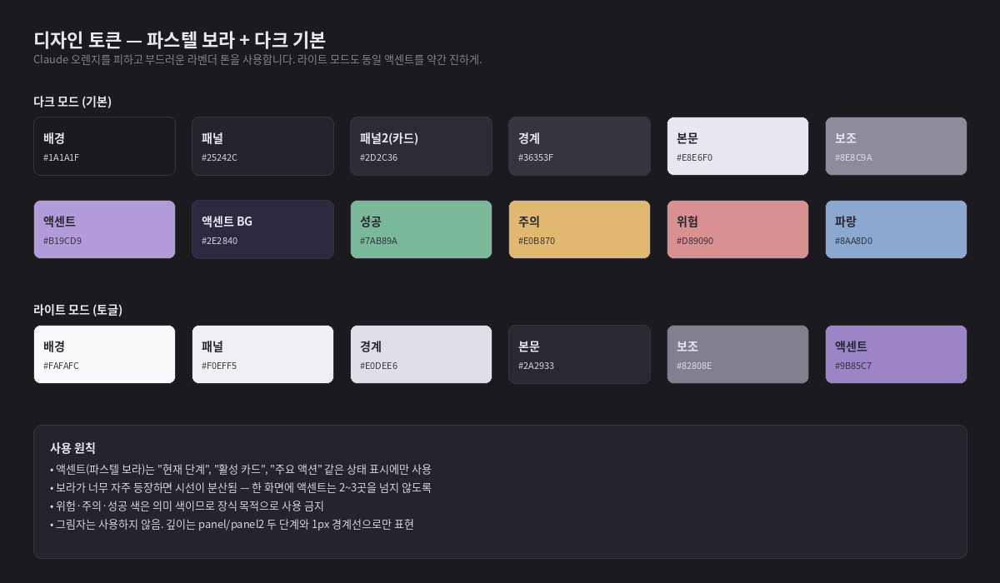
*그림 1. 디자인 토큰 — 콘솔 민트 + 다크 기본 (이미지 갱신 예정)*

#### 컬러 팔레트 (다크 모드 기준)

| 역할 | HEX | 용도 |
|---|---|---|
| 배경 | `#0A0E12` | 메인 캔버스 |
| 패널 | `#0F1419` | 사이드바, 채팅, Roadmap 패널 배경 |
| 패널2 (카드) | `#131A21` | Roadmap Step 노드, 권한 카드 배경 |
| 경계선 | `#1D262F` | 구분선, 테두리 |
| 본문 | `#D7E0E8` | 제목·본문 텍스트 |
| 보조 텍스트 | `#6F7D8A` | 메타·힌트 |
| 액센트 (민트) | `#3AD6A0` | 현재 단계, 활성 카드, 주요 액션 |
| 액센트 배경 | `#0D251E` | 활성 카드 배경, 사용자 메시지 배경 |
| 성공 | `#46D196` | V 통과, 검증 완료 |
| 주의 | `#E8B552` | 편집 도구, 검증 중 |
| 위험 | `#FF6B6B` | bash, 파괴 동작 |
| 파랑 | `#5B8CFF` | 안전 도구, 정보 표시 |

> 액센트(민트)와 성공(녹색)이 근접하다 — 콘솔 톤의 의도적 조화. 의미 구분이 필요한 표면에서 혼동되면 성공 명도를 분리한다.

#### 컬러 팔레트 (라이트 모드)

| 역할 | HEX | 용도 |
|---|---|---|
| 배경 | `#F8FAFA` | 메인 캔버스 |
| 패널 | `#EEF2F2` | 사이드바, 채팅, Roadmap 패널 배경 |
| 경계선 | `#D6DEE0` | 구분선, 테두리 |
| 본문 | `#182024` | 제목·본문 텍스트 |
| 보조 | `#5A6870` | 메타·힌트 |
| 액센트 | `#16A374` | 다크보다 진한 민트(밝은 배경 대비) |
| 액센트 배경 | `#DAF0E8` | 활성 카드 배경 |

#### 타이포그래피

- 한국어 본문: IBM Plex Sans KR (시스템 fallback 허용; Noto Sans KR·Malgun Gothic)
- 영문 본문: IBM Plex Sans (Plex Sans KR 라틴 글리프)
- 코드/모노스페이스: JetBrains Mono 또는 Cascadia Code
- 기본 본문 크기 14px, 보조 텍스트 12px, 제목 H1 22px / H2 17px / H3 15px

#### 레이아웃·간격

- 8px 그리드 — 모든 간격은 8의 배수
- 카드·패널은 각진 모서리 (2~6px), 1px 경계선 — 콘솔 톤
- 그림자는 사용하지 않는다 — 깊이는 패널 두 단계(panel/panel2)와 1px 경계선만으로 표현
- 애니메이션은 200ms 이내, ease-out 기본
- 슬라이드 인/아웃 패널은 280ms로 약간 길게 (시선 유도 효과)

### 2.4 호칭 없음 (시스템 메시지 톤)

UI 텍스트와 AI 응답은 사용자를 직접 호칭하지 않는다. "당신", "사용자", 이름 호명, "학생" 같은 호칭은 사용하지 않고, 시스템이 행동을 서술하는 톤을 유지한다.

> **나쁜 예** — "당신의 프로젝트를 시작합니다", "학생 여러분, 카드를 분해해보세요"
>
> **좋은 예** — "프로젝트가 생성되었습니다", "기능을 작은 단위로 분해하세요"

학생·교사·일반 성인 누가 사용해도 어색하지 않은 톤을 만들기 위함이다. 시스템이 발화 주체로 명확히 인식되어 AI 응답 신뢰도와 분리할 수 있도록 돕는다.

### 2.5 다국어 — 한국어 우선, 영어 지원

- 기본 언어는 한국어 (ko-KR). 첫 실행 시 OS 언어로 자동 감지
- 영어 (en-US) 토글 지원, 설정에서 즉시 전환
- AI에게 보내는 시스템 프롬프트도 언어별로 분기 (한국어 모드에서는 한국어로 응답하도록 지시)
- 번역은 ko/en JSON 리소스 파일로 관리, react-i18next 또는 fluent 사용

### 2.6 다크 / 라이트 모드

두 모드를 동등하게 지원하되, **기본은 다크**다. OS 시스템 설정 자동 감지가 차순위 기본값이며, 사용자가 설정에서 강제 변경할 수 있다. 색상은 디자인 토큰으로 정의되어 모드 전환 시 모든 컴포넌트가 자동으로 따라간다.

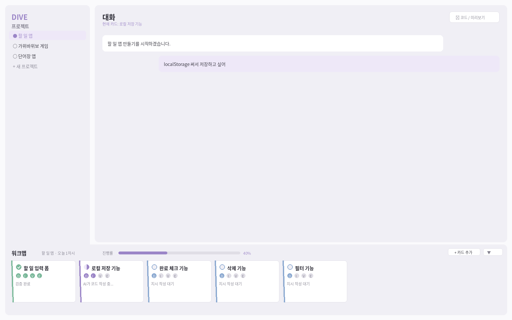
*그림 2. 라이트 모드 메인 화면 (구조 동일, 컬러만 변경)*

---

## 3. 사용자 시나리오

명세서의 모든 기능이 어떻게 결합되는지를 보여주기 위해, 가장 흔한 두 시나리오를 따라가 본다.

### 3.1 시나리오 A — 입문자가 처음 "할 일 앱"을 만든다

#### 상황

정보 교과 학생이 첫 차시에 DIVE를 처음 사용한다. 목표는 브라우저에서 동작하는 단순 할 일 앱을 만드는 것이다.

#### 흐름

1. 앱을 첫 실행한다. 다크 모드로 열리고 온보딩 모달이 프로바이더 연결을 요구한다. 사용자는 OpenRouter API 키를 입력한다.
2. "새 프로젝트" 버튼을 누르고 폴더 위치를 지정한다. 빈 프로젝트가 열리고 우측 Roadmap 패널은 "Plan이 아직 없습니다 — 먼저 무엇을 만들고 싶은지 알려주세요" 안내를 표시한다 ([§4.1.1](#411-진입--plan-존재-확인)).
3. 채팅 입력란에 "할 일 앱 만들고 싶어"라고 입력한다. Interview 모드가 자동 시작되고 AI가 "어디에서 사용할 건가요? 웹 / 모바일 / 데스크톱 중에", "할 일은 PC에만 저장해도 되나요, 다른 기기와 동기화가 필요한가요?" 같은 질문을 한 번에 하나씩 던진다 ([§4.1.2](#412-interview--소크라테스식-의도-파악)).
4. 사용자는 답을 입력하며 의도를 좁혀간다. 충분하다고 판단되면 [인터뷰 완료]를 누른다.
5. AI가 Plan draft를 생성한다. 화면에는 기능 명세서 markdown(스코프 / 비목표 / 인수기준 / Step 4개)과 Step 의존성 mermaid 다이어그램이 함께 표시된다 ([§4.1.3](#413-plan-draft--기능-명세서--사용자-플로우-시각화)). 사용자는 한 번 살펴보고 "단계 2와 3 순서를 바꿔주세요"라고 수정 요청을 한 뒤, 다시 받은 draft에 [승인]을 누른다.
6. Plan이 승인된다. `.dive/plan.json`/`plan.md`/`flow.mmd`가 생성되고, Roadmap 우측 패널에 4개 Step이 의존성 그래프로 표시된다 ([§4.1.4](#414-build--step-세션-할당--상태-추적)).
7. 첫 Step "입력 폼"이 `ready` 상태로 강조된다. 클릭하면 Step 세션이 열리고 D 단계로 진입한다. AI가 카드 초안을 제시하고, 사용자는 그대로 승인 → I 단계 → AI가 `edit_file` 호출 → 노란색(주의) 권한 카드가 채팅에 뜨고 diff가 펼쳐진다 ([§5.5](#55-권한-카드)).
8. 사용자는 +12줄 변경을 확인하고 [승인]. 변경 직후 자동 체크포인트가 찍힌다 ([§6.5](#65-체크포인트-시스템)). 우상단 [코드 / 미리보기] 버튼으로 슬라이드 인 패널의 [미리보기] 탭에서 결과 확인.
9. V 단계로 자동 전환. AI 자체 검증 결과를 사용자가 보고 [최종 승인] ([§4.2.4](#424-v--verify-검증)). Step의 마지막 카드가 Verified 되면 Step 자체가 `done`이 된다. Roadmap에서 첫 Step 노드가 초록색이 되고, 다음 Step의 `blocked`가 풀려 `ready`로 전이.
10. 같은 흐름으로 나머지 Step을 진행. 모든 Step이 done이 되면 Plan은 자동으로 Extend 단계로 진입 ([§4.1.5](#415-extend--통합-검증--수정-반복-재정의)).
11. AI가 통합 점검 결과를 제시한다. 사용자는 직접 앱을 실행해 보고 문제가 없으면 [Plan 마무리]를 눌러 모든 Step을 `shipped`로 마킹한다.

#### 이 시나리오에서 활용되는 기능

- 온보딩 ([§5.7](#57-온보딩-첫-실행)), 프로바이더 연결 ([§7](#7-인증-및-프로바이더))
- 프로젝트 생성, Plan-first 게이트 ([§4](#4-dive-2계층-워크플로우-plan-first))
- Interview 모드 ([§4.1.2](#412-interview--소크라테스식-의도-파악))
- Plan 승인 + mermaid 시각화 ([§4.1.3](#413-plan-draft--기능-명세서--사용자-플로우-시각화))
- Roadmap 우측 패널 ([§5.2](#52-roadmap-우측-패널))
- AI 카드 분해 도움 ([§4.2.2](#422-d--decompose-분해))
- 권한 카드 + diff ([§5.5](#55-권한-카드)), 자동 체크포인트 ([§6.5](#65-체크포인트-시스템))
- AI 자체 검증 + 사용자 최종 승인 ([§4.2.4](#424-v--verify-검증))
- Plan 단위 Extend ([§4.1.5](#415-extend--통합-검증--수정-반복-재정의))
- 슬라이드 인 패널 ([§5.6](#56-슬라이드-인-패널-코드--미리보기--터미널))

### 3.2 시나리오 B — 익숙해진 교사가 본인 도구로 사용한다

#### 상황

정보 교사가 새로운 채점 자동화 스크립트를 작성하기 위해 DIVE를 켠다. 본인은 코딩에 익숙하므로 빠르게 작업하고 싶다.

#### 흐름

1. 새 프로젝트를 연다. ChatGPT Plus 구독 OAuth로 GPT-5.2를 사용 중이다.
2. 채팅 입력란에 "CSV 채점 자동화 스크립트, 입력 형식 결정됐고 출력은 표 한 장이면 됨"이라고 입력. Interview가 시작되지만 의도가 비교적 명확해서 두 번의 Q&A 만에 [인터뷰 완료]를 누른다.
3. AI가 Plan draft에 Step 3개("CSV 파싱", "채점 로직", "결과 출력")를 제안. 사용자는 그대로 [승인] — `.dive/flow.mmd`이 생성된다.
4. Roadmap 우측 패널에 Step 3개가 표시된다. 첫 Step `ready`. 우측 상단 [▼] 버튼으로 Roadmap 패널을 접어 채팅 공간을 넓힌다 ([§5.2.5](#525-펼침--접힘-토글)).
5. 첫 Step을 열어 Step 세션 진입. D 단계에서 카드 1개를 직접 작성, I 단계에서 짧고 명확한 지시를 작성하고 AI에게 코드를 만들게 한다.
6. 권한 카드는 default-allow 옵션으로 빠르게 승인 (설정에서 "신뢰하는 디렉터리에서는 read 도구는 자동 허용" 옵션을 미리 켜둔 상태).
7. V 단계에서 본인이 만든 테스트 케이스를 직접 실행하고 통과 여부를 verify_log에 기록. Step done.
8. 나머지 Step도 같은 흐름으로 진행. 모든 Step이 done이 되면 Plan Extend에서 통합 점검 후 [Plan 마무리].
9. 완성 후 `.dive/` 폴더 제외하고 프로젝트를 압축해 GitHub에 push.

#### 이 시나리오에서 활용되는 기능

- Codex OAuth 인증 ([§7.4](#74-chatgpt-구독-codex-oauth))
- Interview 모드 ([§4.1.2](#412-interview--소크라테스식-의도-파악))
- Roadmap 접기/펼치기 ([§5.2.5](#525-펼침--접힘-토글))
- 자동 승인 정책 ([§8.3](#83-자동-승인-정책))
- 수동 카드 작성 ([§4.2.2](#422-d--decompose-분해))
- Git 저장소와 `.dive/` 분리 ([§10.1](#101-프로젝트-폴더-구조))

---

## 4. DIVE 2계층 워크플로우 (Plan-first)


*그림 3. DIVE 4단계 게이트 — Step 실행 내부에서 작동하는 하위 계층*

DIVE의 사고 절차는 **두 계층**으로 구성된다.

- **상위 계층 — Workspace Plan 흐름** (§4.1) — 사용자의 자연어 요청을 받아 의도를 인터뷰로 정련하고, 기능 명세서와 사용자 플로우를 시각화하여 승인을 받은 뒤, Step 단위로 분해된 구현 일정을 Roadmap으로 추적한다. 진입~승인까지가 "Plan 단계", 승인 이후가 "Build 단계", 전체 완료 후가 "Extend 단계".
- **하위 계층 — Step 실행 D/I/V/E 게이트** (§4.2) — 승인된 각 Step을 실제로 구현하는 세션 안에서, 사고 절차를 D(분해) → I(지시) → V(검증) → E(확장) 4단계로 외화하고 게이트로 강제한다.

상위 흐름은 "**무엇을, 어떤 순서로 만들 것인가**"를 결정하고, 하위 흐름은 각 Step에서 "**한 번의 작업을 어떻게 안전하게 진행할 것인가**"를 결정한다.

### 4.1 상위 계층 — Workspace Plan 흐름

상위 흐름은 5단계로 진행된다. 모든 Plan/Step 메타데이터의 runtime SoT는 SQLite이며 (ADR-080), `.dive/plan.json`·`plan.md`·`flow.mmd`는 **승인 시점의 portable export**다.

```text
[1] 진입 시 Plan 확인  →  [2] Interview  →  [3] 명세·플로우 승인  →  [4] Build  →  [5] Extend
        │                       │                  │                     │            │
   has_approved_plan?     소크라테스식         기능명세서 + 사용자       Step 세션      통합 검증
   true → Roadmap 즉시    의도 파악            플로우 mermaid           할당 + 상태    + 수정 반복
   false → Interview                          시각화 + 수정 요청        추적
```

#### 4.1.1 진입 — Plan 존재 확인

워크스페이스(프로젝트)에 진입하면 즉시 `workspace_plan_status(project_id)`를 호출한다.

| `has_approved_plan` | 화면 동작 |
|---|---|
| `true` | 우측 Roadmap 패널에 Step 의존성 그래프(`flow.mmd` 동등)가 즉시 렌더된다. 사용자는 별도 진입 동작 없이 진행 상황을 한눈에 본다. |
| `false` (`needs_interview`) | 채팅 영역이 Interview 모드로 잠긴다. 사용자가 자연어로 만들고 싶은 것을 입력하면 Interview가 자동 시작된다. mutating 도구는 차단된다. |

> **SoT 정책 (ADR-080):** SQLite의 `Plan` 테이블이 runtime 진실. `.dive/plan.json` 파일은 승인 시점의 snapshot이며, 프로젝트 폴더 이동·백업·외부 검토용 portable format으로만 사용한다. 파일과 SQLite가 충돌할 경우 SQLite가 우선이며, 앱 시작 시 `.dive/plan.json`이 있고 SQLite Plan이 없으면 import(복원)한다.

#### 4.1.2 Interview — 소크라테스식 의도 파악

사용자의 첫 자연어 요청은 곧장 코드로 가지 않고, **Interview 모드**로 진입한다. AI는 모호한 부분을 좁히는 질문을 한 번에 하나씩 던지고, 사용자는 답하면서 자기 의도를 외화한다.

| 항목 | 정책 |
|---|---|
| 질문 방식 | 한 번에 1~2개. 닫힌 질문(예/아니오)과 열린 질문 혼합. "그냥 적당히"는 거부하고 구체화 요구. |
| 종료 조건 | 사용자가 [인터뷰 완료]를 누르면 `Interview.status = submitted`. AI가 충분하다고 판단해도 자동 종료 X(사용자 결정 우선). |
| 저장 | 매 Q&A는 `Interview.questions` JSON에 누적, 미해결 질문은 `unresolved_questions`에 별도 보관. 의도 요약은 `intent_summary`. |
| 다시 시작 | 사용자가 인터뷰 폐기를 선택하면 `status = discarded`. 새 Interview를 만들 수 있다. |
| 외부 도구와 구분 | 본 기능은 제품 내장 'Interview' 단계다. internal deep-interview 스킬과 명칭은 비슷하지만 별개의 제품 기능. |

이 단계에서 mutating 도구(`edit_file`/`bash` 등)는 권한 카드 단계까지 가지 않고 게이트에서 차단된다 — `chat_send`의 `run_mode = Interview`.

#### 4.1.3 Plan Draft — 기능 명세서 + 사용자 플로우 시각화

Interview가 완료되면 AI는 `workspace_plan_generate_draft`로 Plan draft를 생성한다. draft는 두 가지 산출물로 시각화되어 승인 화면에 노출된다.

| 산출물 | 형식 | 내용 |
|---|---|---|
| 기능 명세서 | Markdown 미리보기 (`.dive/plan.md` 동등) | goal · intent_summary · scope · non_goals · constraints · acceptance_criteria · Step 목록 |
| 사용자 플로우 / Step DAG | Mermaid `flowchart TD` (`.dive/flow.mmd` 동등) | Step 간 dependency edge, parallel_group 표시. v0.3에서는 사용자 플로우 다이어그램과 Step 의존성 그래프를 **하나의 mermaid 산출물로 통합**(`flow.mmd`)한다. |

승인 화면 동작:

- **[수정 요청]** — 자연어로 "단계 2와 3 순서를 바꿔주세요" 같은 요청을 입력하면 AI가 draft를 재생성한다. Plan 상태는 `draft` 유지.
- **[승인]** — `workspace_plan_approve(plan_id)` 호출 → `Plan.status = approved`, `approved_at = now`, `.dive/plan.json`/`plan.md`/`flow.mmd` 파일 export. 이후 Build 단계 활성.
- **[폐기]** — Plan을 폐기하고 Interview로 회귀.

> **승인 게이트:** `Plan.status != approved`인 동안 mutating 도구는 차단된다. 승인은 Build 모드의 단일 진입 게이트.

#### 4.1.4 Build — Step 세션 할당 + 상태 추적

승인된 Plan의 각 Step은 Roadmap에 카드로 표시된다. Step 카드 상태는 `StepSessionMapping.status`에서 유도된다.

| 상태 | 의미 | 화면 표현 |
|---|---|---|
| `blocked` | dependency가 아직 done이 아님 | 회색, "대기 중인 의존성: …" |
| `ready` | dependency 모두 done, 시작 가능 | 보라 강조, [열기] 액션 |
| `in_progress` | 매핑된 Session/Card에서 D/I/V/E 진행 중 | 보라 진행 표시 + 한 줄 요약 |
| `review` | Step verify 완료, 사용자 최종 승인 대기 | 노랑 강조 |
| `done` | 사용자 승인 완료 | 초록 |
| `shipped` | Plan 전체 Extend 후 마킹 | 초록 + ✓ |

Step 카드를 [열기]하면 `workspace_plan_step_open(step_id)` → 매핑된 Session/Card가 없으면 새로 생성, 있으면 재사용. 이때 채팅 컨텍스트로 Step의 `instruction_seed`/`acceptance_criteria`/`expected_files`가 Agent에 주입된다.

각 Step 세션 안에서는 §4.2의 D/I/V/E 게이트가 그대로 작동한다 — 즉, **상위 Plan 흐름이 "Build" 상태일 때, 각 Step 세션 내부는 D/I/V/E 4단계를 순환**한다. Step의 모든 카드가 V 통과하면 `StepSessionMapping.status = review`, 사용자가 Plan Roadmap에서 [최종 승인]을 누르면 `done`.

> **상태 영속화:** Step별 세션 상태는 SQLite의 `StepSessionMapping` row에 보관된다 (ADR-080: SQLite=runtime SoT). 별도 `.dive/state/step-XXX.json` 파일은 두지 않는다. 외부 도구가 진행 상황을 읽으려면 Plan 승인 시점에 export된 `.dive/plan.json`을 참조하거나 IPC를 호출한다.

#### 4.1.5 Extend — 통합 검증 + 수정 반복 (재정의)

모든 Step이 `done` 상태가 되면 Plan은 자동으로 **Extend** 상태로 진입한다. 본 단계는 v0.2까지의 카드 단위 E를 **Plan 단위 통합 검증**으로 격상·재정의한 것이다.

가능한 동작:

- **통합 점검** — AI가 전체 코드를 검토하고 Step 간 충돌·누락·미흡한 부분을 보고. 발견되면 사용자는 해당 Step을 다시 `in_progress`로 되돌려 수정한다.
- **사용자 수동 검증** — 사용자가 직접 앱을 실행해 보고, 문제를 발견하면 Step 회귀 또는 신규 Step 추가.
- **신규 Step 추가** — 새 요구사항이 떠오르면 Plan에 Step을 추가한다. 새 Step도 dependency를 명시하면 Roadmap이 다시 blocked/ready로 정렬한다.
- **Plan 마킹** — 사용자가 [Plan 마무리]를 누르면 모든 Step의 status가 `shipped`로 일괄 갱신, Plan이 종료된다.

> **재정의 근거:** v0.2까지 E는 카드 단위(세션 내부)에서만 의미가 있었다. v0.3 Plan-first 흐름에서는 Plan 전체의 통합 검증과 수정 반복이 필요하므로, "E"의 위계를 Plan 단위로 옮긴다. Step 내부의 E(§4.2.5)는 "Step 카드 일괄 통합 점검"으로 의미가 좁혀진다.

#### 4.1.6 산출물(`.dive/`) 파일 정책

승인된 Plan은 다음 파일을 `.dive/`에 export한다 — 모두 SQLite로부터 결정론적으로 재생성 가능한 snapshot이다.

| 파일 | 형식 | 용도 |
|---|---|---|
| `.dive/plan.json` | JSON | 외부 도구·백업·복원용 portable Plan 직렬화 |
| `.dive/plan.md` | Markdown | 사람이 읽는 기능 명세서 |
| `.dive/flow.mmd` | Mermaid `flowchart TD` | Step 의존성 다이어그램 (사용자 플로우 통합) |

Step 또는 Plan이 변경되어 `approved_at`이 갱신되면 세 파일을 모두 lazy 재생성한다. 사용자는 파일을 직접 편집해서는 안 된다 — 편집은 IPC를 통해서만 한다.

### 4.2 하위 계층 — Step 실행 D/I/V/E 게이트

하위 계층은 각 Step의 **실행 세션 내부**에서 작동하는 강제 게이트다. v0.2까지의 §4 본문이 이 계층에 해당한다. 한 Step 세션은 하나 이상의 카드를 가지며, 카드 단위로 D → I → V → (E)를 순환한다.

#### 4.2.1 단계 정의

| 단계 | 약자 | 명칭 | 핵심 활동 |
|---|---|---|---|
| Decompose | D | 분해 | Step의 작업을 카드 단위로 쪼갠다 |
| Instruct | I | 지시 | 카드별 지시를 작성하고 AI가 실행한다 |
| Verify | V | 검증 | AI 자체 검증 + 사용자 최종 승인 |
| Extend (Step) | E | 확장 | Step 내부 카드 통합 점검, Plan 단위 Extend는 §4.1.5 |

#### 4.2.2 D — Decompose (분해)

##### 목적
Step에 정의된 작업을 카드 단위로 쪼갠다. 카드의 단위는 "한 번의 채팅 흐름으로 완성할 수 있는 작은 기능"이다.

##### 진입 조건
- Step 세션이 시작될 때 자동으로 D 단계로 진입한다. Step의 `instruction_seed`가 카드 분해의 초안이 된다.

##### 통과 조건
- Roadmap 패널의 Step 내부 카드가 최소 1개 이상 존재해야 한다.
- AI가 사용자 입력을 분석해 적절한 카드 수를 제안할 수 있다 — AI 판단에 따라 1~10개 사이.
- 사용자는 AI 제안을 수용·수정·전부 새로 작성할 수 있다.

##### 카드 작성 방식 (3가지)

1. **AI 제안** — Step `instruction_seed`로부터 AI가 카드 초안을 제시. 사용자는 일괄 수락 또는 개별 편집.
2. **직접 작성** — "+ 카드 추가" 버튼으로 사용자가 직접 카드를 만든다. 카드 제목만 입력하면 된다.
3. **혼합** — 일부 카드는 사용자가 만들고, 나머지는 AI 도움. 자유롭게 섞어 사용 가능.

##### 카드 데이터
- `id`, `title` (필수), `instruction` (I 단계에서 채워짐), `state`, `position`, `changed_files`, `session_id`
- 카드는 드래그로 순서 변경 가능. 순서가 진행 순서를 의미하지는 않지만, 의존성을 시각적으로 표현하는 데 사용.

#### 4.2.3 I — Instruct (지시)

##### 목적
각 카드에 대한 구체적 지시를 작성하고, AI가 실제 작업을 수행한다. 모호한 지시는 AI가 되묻고, 사용자는 답하면서 프롬프트 정련 능력을 익힌다.

##### 진입 조건
- D 단계 통과 후, 카드를 클릭하면 해당 카드가 I 단계로 진입.
- 한 번에 하나의 카드만 I 단계에 있을 수 있다 (다중 진행 불가).

##### 통과 조건
- 해당 카드의 `instruction` 필드가 1자 이상이어야 한다.
- AI가 도구 호출을 통해 작업을 수행했어야 한다 (텍스트 응답만으로는 V로 진행 불가).

##### AI 동작
- 현재 카드의 컨텍스트를 시스템 프롬프트에 주입한다 — "현재 작업 중인 Step: [Step 제목]" + "현재 카드: [카드 제목]" + Step의 `acceptance_criteria`/`expected_files`.
- 지시가 모호하면 AI는 명확화 질문을 던진다. 답변이 충분할 때까지 도구 호출을 보류.
- 도구 호출 시 권한 카드를 통해 사용자 승인을 받는다 ([§5.5](#55-권한-카드)).
- 변경된 파일은 카드의 `changed_files`에 기록되어, 추후 [코드 보기]로 조회 가능.

#### 4.2.4 V — Verify (검증)

##### 목적
AI 자체 검증 결과를 사용자가 확인하고 최종 승인한다. 단순 클릭이 아닌 **"AI가 검증을 했고 사용자가 그 결과를 본 후 승인"** 2단계 게이트.

##### 진입 조건
- I 단계에서 도구 호출이 1회 이상 있었고, 사용자가 [검증 시작] 버튼을 누른다.

##### AI 자체 검증 절차

1. 카드 의도(및 Step의 `acceptance_criteria`)와 변경된 코드의 일치 여부를 AI가 자체 분석한다.
2. 실행 가능한 코드라면 적절한 도구로 실행하고 결과를 확인한다 (예: 웹: 미리보기 캡처, Python: 실행 후 출력 확인).
3. Step에 `verification.kind = command`가 정의되어 있으면 해당 명령을 실행해 결과를 검증 evidence로 기록.
4. 검증 결과를 카드의 `verify_log` + `StepSessionMapping.verification_evidence`에 구조화 저장.

##### 사용자 최종 승인
- AI 검증 결과 화면을 사용자가 본다. 슬라이드 인 패널의 [미리보기] 탭으로 결과 확인 권장.
- [최종 승인] 또는 [거부 — I로 돌아가기] 중 선택.
- 거부 시 카드는 Rejected 상태가 되고, 사용자는 instruction을 수정해 다시 I 단계로 진입.

##### 통과 조건
- AI 자체 검증이 실행되었고 (성공·실패 무관), 사용자가 [최종 승인]을 눌렀다.

#### 4.2.5 E — Extend (Step 단위 통합 점검)

##### 목적
Step 내부의 검증된 카드들을 Step 단위로 통합 점검한다. **Plan 단위 통합 검증은 §4.1.5에서 별도로 다룬다.**

##### 진입 조건
- 현재 Step의 모든 카드가 Verified 상태여야 한다.

##### 가능한 동작
- **Step 내부 통합 점검** — AI에게 Step의 변경 파일들을 검토하게 하고, Step 내부에서의 충돌·개선점을 받는다.
- **새 카드 추가** — Step 안에서 추가 작업이 필요하면 새 카드를 만들고 D → I → V 흐름을 다시 탄다.
- **Step 마무리** — Step의 `StepSessionMapping.status = review`로 전환, Plan Roadmap에서 사용자 최종 승인 대기.

#### 4.2.6 카드 상태 머신

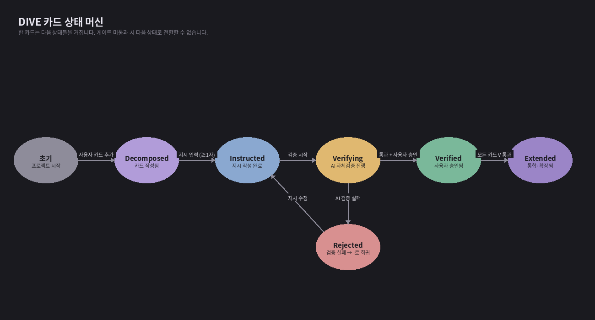
*그림 4. 카드 상태 전이 — 게이트 미통과 시 다음 상태로 갈 수 없다*

카드 상태 enum:

```rust
pub enum CardState {
    Decomposed,   // 카드 작성됨, 지시 없음
    Instructed,   // I 단계, 지시 작성됨
    Verifying,    // V 단계 진입, AI 자체검증 진행 중
    Verified,     // 사용자 최종 승인됨
    Rejected,     // 사용자 거부, I 단계로 회귀 가능
    Extended,     // E 단계에서 Step 내부 통합·확장 완료
}
```

#### 4.2.7 게이트 강제의 구현 원칙

게이트는 다음 두 곳에서 강제된다:

1. **Rust 백엔드의 DIVE Gate Engine** — 채팅 메시지가 Agent Loop로 들어가기 전에 현재 `run_mode`(Interview/Plan/Build)와 카드 상태를 확인하고 통과하지 못하면 메시지를 거절한다. UI를 우회해도 백엔드에서 차단된다.
2. **프론트엔드 UI** — 채팅 입력란, 단계 전환 버튼, V 진입 버튼 등을 통과 조건이 충족되지 않으면 disabled 상태로 표시한다. 사용자는 어떤 조건이 부족한지 볼 수 있다.

`run_mode` 매트릭스:

| `run_mode` | 허용 도구 | 차단 도구 | 진입 조건 |
|---|---|---|---|
| `Interview` | 안전 도구(read·search) | mutating 도구 전부 | Plan이 없거나 Interview status = draft/submitted |
| `Plan` | 안전 도구 | mutating 도구 전부 | Plan status = draft (승인 전) |
| `Build` | 안전 + 주의 + 위험 도구(권한 카드 경유) | — | Plan status = approved AND Step 매핑 존재 |

> **Note:** 게이트 우회는 정식으로 지원하지 않는다. 개발자가 직접 빌드하면 빌드 플래그(`--features no-gate`)로 끌 수 있도록 코드는 제공하되, 배포되는 바이너리에는 포함하지 않는다.

---

## 5. 화면 명세

### 5.1 메인 화면 — 좌(사이드바) · 중(채팅) · 우(Roadmap) 3패널

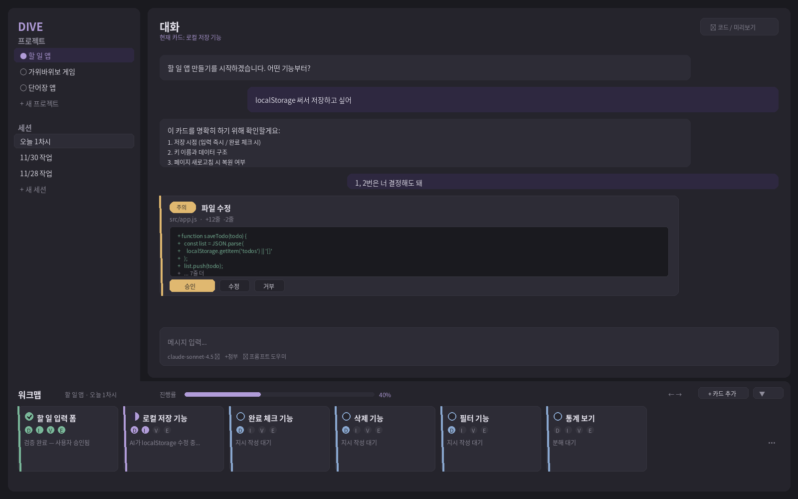
*그림 5. 메인 화면 (다크, Roadmap 패널 표시 — 기본 상태)*

**메인 영역**은 3개 column 그리드다. 좌측은 사이드바(280px 고정), 중앙은 채팅(메인 작업 공간), 우측은 **Roadmap 패널**(360px, 승인된 Plan이 있을 때 표시)이다. 코드와 미리보기는 평소 보이지 않으며, 채팅 우상단의 [코드 / 미리보기] 버튼으로 슬라이드 인 패널을 열어 확인한다.

> **v0.3 변경 — "워크맵 하단 가로 띠"의 Roadmap 흡수**
>
> v0.2의 "하단 가로 띠 워크맵"은 v0.3에서 우측 Roadmap 패널로 흡수되었다. Plan-first 흐름에서 진행 시각화의 1차 단위가 **Step 의존성 그래프**로 격상되었기 때문이다. Step 내부의 카드 단위 진행은 Roadmap 패널에서 Step 노드를 펼치거나 Step Detail 슬라이드 인에서 확인한다. v0.2 워크맵 UI 명세(가로 띠·접힘 80px·카드 타일)는 §5.2.5에서 Roadmap 패널의 접힘/펼침 모드로 통합되었다.

#### 5.1.1 좌측: 사이드바 (폭 280px, 고정)

- 상단: DIVE 로고 (민트)
- **프로젝트 목록** — 최근 사용 순으로 정렬, 클릭 시 프로젝트 전환
- **+ 새 프로젝트** 버튼 — 폴더 선택 다이얼로그
- 현재 프로젝트의 **세션 목록** — Step 매핑된 Session은 Step ID와 함께 표시 ("step-002 · 채점 로직")
- **+ 새 세션** 버튼 (Plan 승인 후에는 Step Open이 권장 경로)
- 하단: 현재 사용 중인 프로바이더·모델 미니 카드 — 클릭 시 프로바이더 설정 화면

#### 5.1.2 중앙: 채팅 (메인 작업 공간)

채팅이 그리드 중앙을 차지한다. 입문자에게 가장 중요한 활동이 "AI와의 대화"임을 시각적으로 강조하기 위함이다.

- 상단: "대화" 제목 + 현재 Step/카드 표시 + 우측 [코드 / 미리보기] 버튼
- 메시지 스트림 — 사용자 메시지(우측 정렬, 민트 액센트 배경), AI 메시지(좌측 정렬, 패널2 배경), 도구 호출(권한 카드)
- 하단: 입력란 — 메시지 입력 + 파일 첨부 + 모델 셀렉터(드롭다운) + 프롬프트 도우미 버튼
- `run_mode` 표시 — 입력란 좌상단에 현재 모드 배지(Interview / Plan / Build) + 차단된 도구가 있으면 그 사유 미니 안내

#### 5.1.3 우측: Roadmap 패널 (폭 360px)

- Plan 승인 여부에 따라 자동 표시/숨김 — `workspace_plan_status.has_approved_plan = true`이면 표시
- **상단**: Plan 요약(goal·진행률·`approved_at`) + [▼]/[▲] 펼침/접힘 토글
- **본문**: Step 의존성 그래프 — 노드 클릭 시 Step Detail 슬라이드 인 호출, [열기] 액션으로 매핑된 Session 진입
- **하단**: 현재 활성 Step의 한 줄 요약, [Plan 다시 보기] 링크 (`.dive/plan.md` 미리보기)

#### 5.1.4 슬라이드 인 패널 (필요 시)

- 채팅 우상단 [코드 / 미리보기] 버튼 또는 Roadmap의 [완료] Step 클릭으로 호출
- 280ms 슬라이드 인 애니메이션
- **3개 탭**: 코드 / 미리보기 / 터미널 (§5.4)
- 별도로 **Step Detail 슬라이드 인**: Step 메타데이터(instruction_seed·acceptance_criteria·verification·`changed_files`·checkpoint 목록) 표시
- [✕] 버튼 또는 ESC로 닫음
- 패널 폭은 약 600px (조절 가능)

### 5.2 Roadmap (우측 패널)

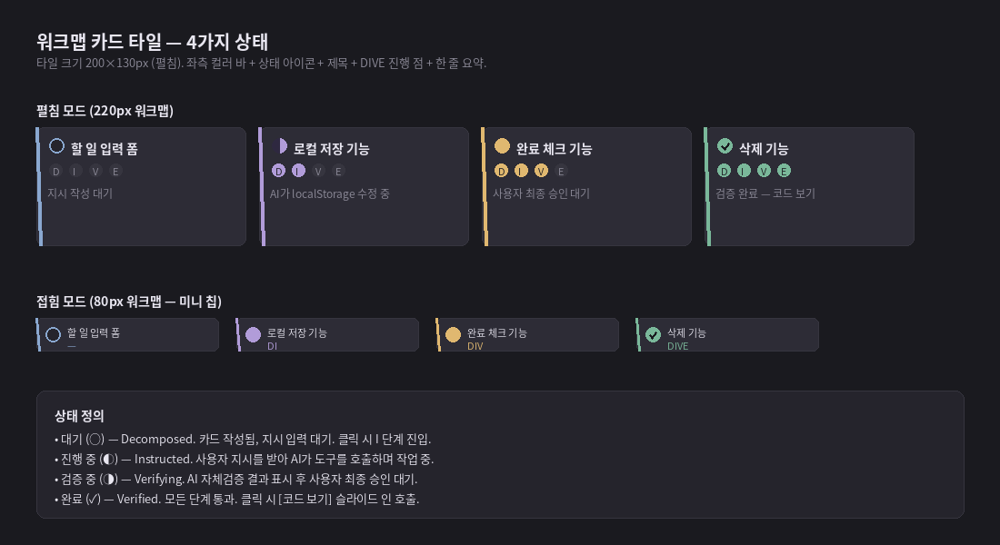
*그림 6. Roadmap 패널 — Step 노드 4가지 상태 (blocked / ready / in_progress / done)*

#### 5.2.1 Step 노드 — 펼침 모드

세로로 쌓이는 노드 카드. 좌측 컬러 바 + 상단 아이콘·제목 + 의존성 화살표 + 하단 한 줄 요약 + 액션 버튼.

| 영역 | 내용 |
|---|---|
| 좌측 4px 바 | 상태별 색상 (blocked=회색, ready=파랑, in_progress=보라, review=주의, done/shipped=성공) |
| 상태 아이콘 (좌상단) | 🔒(blocked), ○(ready), ◐(in_progress), ◑(review), ✓(done), 🚀(shipped) |
| 제목 | Bold 14px, Step `title` |
| 의존성 표시 | 상위 노드와 연결되는 화살표 (`flow.mmd` 동등) |
| 한 줄 요약 | 12px, 회색, 현재 Step의 상태 또는 활성 카드 진행 |
| 병렬 그룹 | `parallel_group`이 같은 노드들은 같은 색 배지로 묶임 |

#### 5.2.2 Step 노드 — 접힘 모드

미니 칩 형태. Plan 진행률 + 다음 ready Step 1개 + 전체 갯수만 노출.

| 영역 | 내용 |
|---|---|
| 좌측 3px 바 | 활성 Step 상태 색 |
| Plan 진행률 | "3/7 done" 같은 텍스트 |
| 다음 ready | Step 제목 미니 칩 |

#### 5.2.3 Step 노드 클릭 동작

- **blocked**: 클릭 시 누락된 dependency 목록을 툴팁/슬라이드 인으로 표시 (열 수 없음)
- **ready**: `workspace_plan_step_open(step_id)` 호출 → Session/Card 생성 또는 재사용 → 채팅 컨텍스트 전환
- **in_progress / review**: 매핑된 Session으로 즉시 전환
- **done / shipped**: 읽기 전용. 클릭 시 Step Detail 슬라이드 인이 열려 changed_files / verification evidence / checkpoint 목록 노출

#### 5.2.4 한 줄 요약

Step 상태별 한 줄 요약은 펼침 모드에서 항상 표시되는 것이 기본이다.

| Step 상태 | 한 줄 요약 예시 |
|---|---|
| blocked | "대기 중인 의존성: step-001, step-002" |
| ready | "시작 가능 — Step을 클릭해 진행" |
| in_progress | "AI가 localStorage 저장 코드 작성 중...", "edit_file 승인 대기" |
| review | "AI 자체검증 완료, Roadmap에서 최종 승인 대기" |
| done | "검증 통과 — 코드 보기로 결과 확인 가능" |
| shipped | "Plan 마무리됨" |

#### 5.2.5 펼침 / 접힘 토글

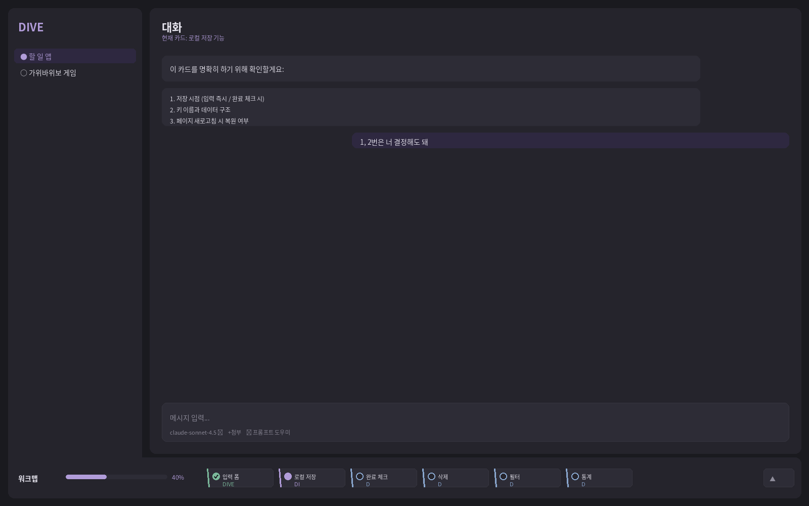
*그림 7. Roadmap 접힘 모드 — 채팅 공간이 넓어진다*

- Roadmap 패널 헤더의 [▼] / [▲] 버튼으로 토글
- **펼침 (기본, 360px)** — Step 노드 + 의존성 그래프 + 한 줄 요약 모두 표시
- **접힘 (60px)** — 세로 미니 칩 (활성 Step + 진행률만)
- 접힘 상태는 프로젝트 단위로 저장됨 (`workspace_plan_ui.collapsed` 필드)

#### 5.2.6 스크롤·확대축소

- Step 노드가 패널 높이를 초과하면 세로 스크롤
- mermaid 그래프 영역은 핀치/휠 줌 지원 (50%~200%)
- 키보드: ↑/↓로 노드 탐색, Enter로 진입 또는 Step Detail 열기

#### 5.2.7 진행률 표시

- Roadmap 헤더에 가로 바
- 완료 Step / 전체 Step 비율 (단계 가중치는 적용하지 않음 — Step 단위가 충분히 작음을 가정)
- "3/7 (43%)" 같은 숫자 라벨 동반
- Plan 승인 시점 vs 현재 시점의 ETA(추정) 비교는 v0.4 검토

#### 5.2.8 Plan 편집 액션

- Roadmap 헤더 우측에 [Plan 편집] 버튼 — 클릭 시 Plan 수정 다이얼로그 (Step 추가·dependency 변경)
- Plan이 `approved` 상태일 때도 편집 가능, 단 편집 시 `approved_at` 갱신 + 영향받는 Step의 매핑 재정렬 + `.dive/plan.json` 재export
- 신규 Step 추가는 Extend 단계의 정식 액션이지만, Plan 편집 다이얼로그를 통해서도 가능 ([§4.1.5](#415-extend--통합-검증--수정-반복-재정의))

### 5.3 채팅 영역 상세

#### 5.3.1 메시지 종류

| 종류 | 시각 표현 | 동작 |
|---|---|---|
| 사용자 메시지 | 우측 정렬, 민트 액센트 배경, 각진 모서리 | 편집·재전송 가능 |
| AI 텍스트 응답 | 좌측 정렬, 패널2 배경 | 복사·인용 가능 |
| 도구 호출 (권한 카드) | 인라인 카드, 위험도별 색상, diff 포함 | 승인·수정·거부 |
| 도구 결과 | 접힌 형태 (펼쳐 보기 가능), 미니멀 | 실행 결과 본문 |
| 시스템 메시지 | 중앙 정렬, 작은 글씨 | 단계 전환·체크포인트 등 알림 |
| 에러 | 빨간 좌측 바 | 재시도 버튼 |

#### 5.3.2 모델 셀렉터

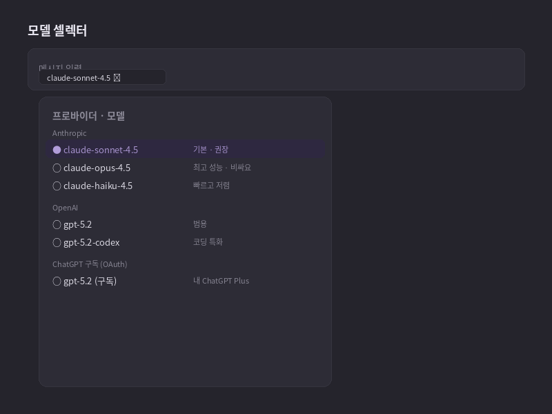
*그림 8. 모델 셀렉터 드롭다운*

- 현재 선택된 모델은 입력란 좌측 하단에 작은 칩으로 표시
- 칩 클릭 시 드롭다운 — 등록된 모든 프로바이더와 모델 목록
- 프로바이더별 그룹핑, 권장 모델은 별표 표시
- 드롭다운 하단에 "프로바이더 추가" 링크

#### 5.3.3 프롬프트 도우미

- 입력란 우측의 작은 아이콘 (✨)
- 클릭 시 사이드 패널 — 현재 단계에 맞는 템플릿 카드
- 실시간 모호함 감지 (옵션) — 입력 중 "이 버튼", "그거" 같은 지시 대명사 감지 시 노란 경고
- "보내기 전 점검" 버튼 — AI가 자기 프롬프트를 자체 비평

#### 5.3.4 [코드 / 미리보기] 버튼

채팅 우상단 작은 버튼. 클릭 시 슬라이드 인 패널이 우측에서 열림. 패널이 이미 열려 있으면 닫음 (토글).

### 5.4 슬라이드 인 패널 (코드 / 미리보기 / 터미널)

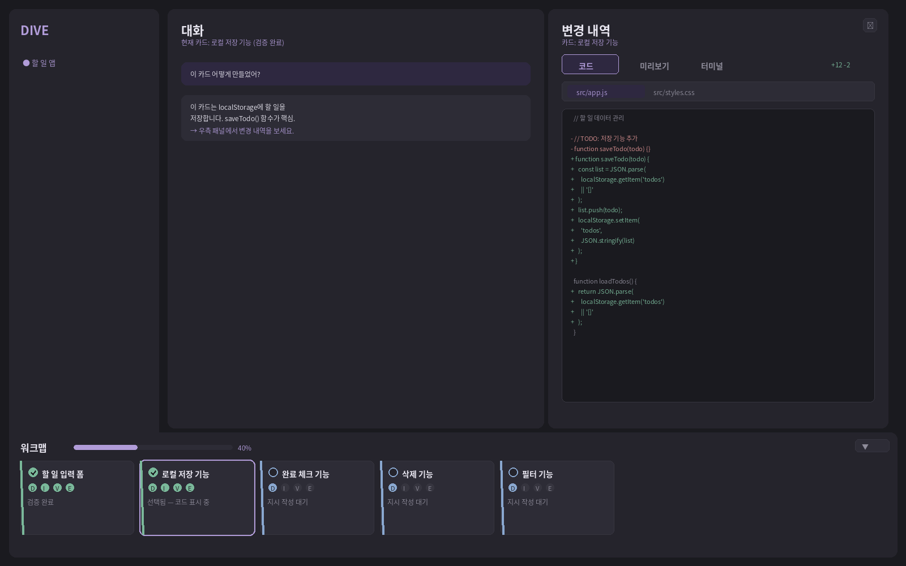
*그림 9. 슬라이드 인 패널 — 카드 단위 변경 내역*

#### 5.4.1 호출 방식

- **채팅 우상단 [코드 / 미리보기] 버튼** — 가장 일반적인 호출
- **Roadmap [완료] Step 클릭** — 해당 Step의 변경 내역(`StepSessionMapping.changed_files` 합산)으로 자동 필터링되어 열림
- **권한 카드의 [전체 보기] 링크** — 긴 diff를 패널에서 펼쳐 보기

#### 5.4.2 패널 구성

- 상단: 컨텍스트 헤더 ("카드: 로컬 저장 기능") + [✕] 닫기
- 탭 바: **코드** / **미리보기** / **터미널**
- 본문: 선택된 탭의 내용
- 하단: 메타 정보 (체크포인트 정보, 마지막 변경 시각)

#### 5.4.3 코드 탭

- 변경된 파일 탭 (해당 카드 또는 세션이 수정한 파일 목록)
- 본문: 선택된 파일의 diff (전체 표시)
- diff 색상: `+` (`#7AB89A`), `-` (`#D89090`), 변경 없음 (회색)
- 읽기 전용 — Monaco 같은 IDE 패널은 사용하지 않음
- 자유 편집이 필요하면 사용자가 직접 외부 에디터로 파일을 연다

> **IDE 패널을 두지 않는 이유:** Monaco 같은 풀-IDE 패널은 입문자에게 부담이다. 코드를 자유롭게 편집할 수 있는 권한도 의도된 제약을 무너뜨린다(권한 카드 우회). 사용자는 "AI가 무엇을 했는지" diff로 확인하면 충분하다.

#### 5.4.4 미리보기 탭

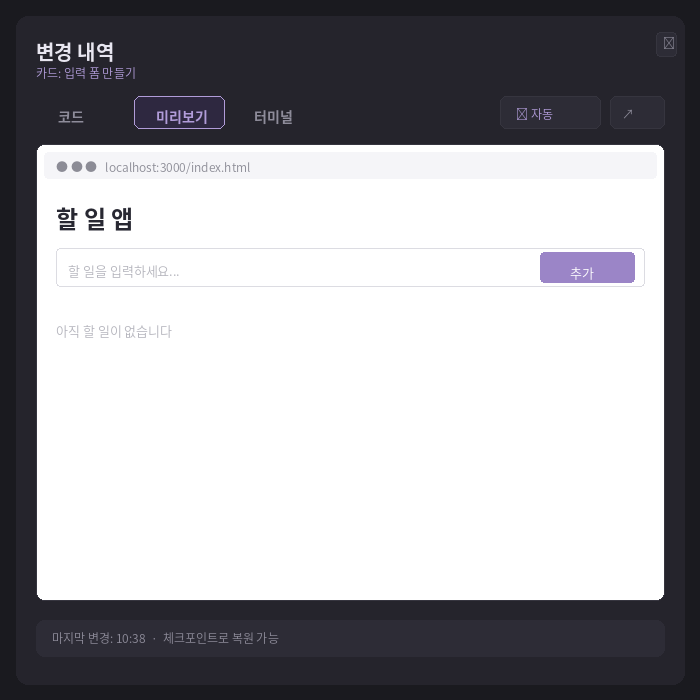
*그림 10. 미리보기 탭 — 웹 프로젝트의 iframe 임베드*

- **웹 프로젝트** (`index.html` 존재): iframe 임베드 — 파일 변경 시 자동 새로고침
- **Python 프로젝트**: 마지막 실행 결과 (stdout/stderr) 표시
- **Roblox/Luau**: 외부 Roblox Studio 연결 안내 (직접 임베드 불가)
- **기타** (CLI 도구·라이브러리): README 또는 빈 상태 일러스트

미리보기 컨트롤:
- 자동 새로고침 토글 (기본 ON)
- 수동 새로고침 버튼
- 새 창에서 열기 (외부 브라우저)

#### 5.4.5 터미널 탭

- bash 도구 실행 출력이 누적되어 표시
- 읽기 전용 — 사용자가 직접 명령을 입력할 수는 없음 (모든 명령은 AI 경유)
- 이는 의도된 제약 — 권한 카드를 거치지 않는 명령 실행을 방지

### 5.5 권한 카드

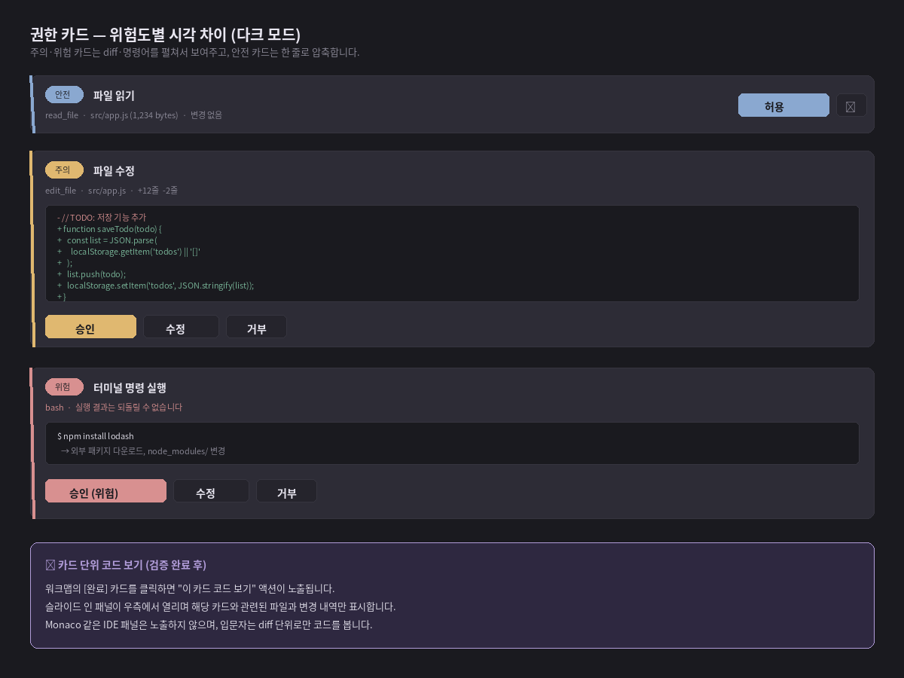
*그림 11. 권한 카드 — 위험도별 시각 차이 (안전·주의·위험)*

#### 5.5.1 위험도 분류

| 위험도 | 색상 | 도구 예시 | 카드 노출 정보 |
|---|---|---|---|
| 안전 | 파랑 `#8AA8D0` | `read_file`, `list_dir`, `search` | 도구명 + 한 줄 설명 (압축) |
| 주의 | 주의 `#E0B870` | `edit_file`, `write_file`, `mkdir` | 도구명 + diff 본문 (펼침) |
| 위험 | 위험 `#D89090` | `bash`, `run_process`, `web_fetch` | 도구명 + 명령어 본문 + 위험 사유 |

#### 5.5.2 권한 카드 동작

- AI가 도구 호출을 시작하면, 카드가 채팅 스트림에 인라인으로 나타난다.
- 카드 표시 시점에 도구 호출은 일시정지 — 사용자 결정을 기다린다.
- **[승인]** — 도구 실행, 결과를 채팅 스트림에 추가, AI 다음 응답으로 진행
- **[수정]** — 도구 인자를 사용자가 직접 편집한 후 실행 (예: 명령어 수정)
- **[거부]** — 도구 호출 취소, AI에게 "사용자가 거부함" 메시지 전달, AI 재시도
- **타임아웃 없음** — 사용자가 결정할 때까지 대기

#### 5.5.3 카드 안에서의 정보 노출 (입문자 친화)

- **안전 카드** — 도구 이름 + 한 줄 설명만 (압축). diff 표시 없음.
- **주의 카드** — 도구 이름 + 변경 요약 + diff 본문 (펼친 상태). 가장 중요한 입문자 학습 지점.
- **위험 카드** — 도구 이름 + 명령어/입력 본문 + 위험 사유 안내
- diff 표시는 화면 안쪽 회색 박스 안에 `+` (초록), `-` (분홍) 색상 구분
- diff가 길면 [전체 보기 ↓] 링크로 슬라이드 인 패널의 [코드] 탭에서 펼쳐 봄
- 권한 카드 자체에는 5~7줄 정도만 표시

#### 5.5.4 자동 승인 정책 (사용자 설정)

- 기본값: 모든 도구 수동 승인
- 사용자가 설정에서 켤 수 있음 — "안전 도구는 자동 승인" (read 도구만)
- 주의·위험 도구는 자동 승인 옵션 없음 — 항상 수동
- 차단 명령 블록리스트는 항상 적용 ([§9.2](#92-차단-명령-블록리스트))

### 5.6 슬라이드 인 패널 (코드 / 미리보기 / 터미널)

[§5.4](#54-슬라이드-인-패널-코드--미리보기--터미널) 참조 — 본 패널의 탭 구조는 통합되어 있다.

### 5.7 온보딩 (첫 실행)

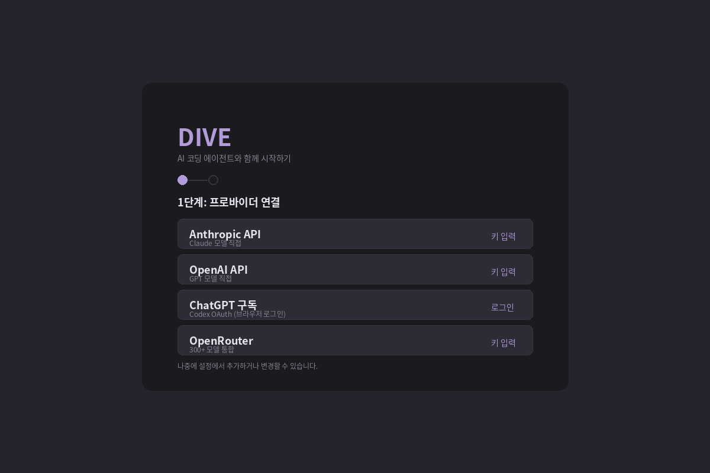
*그림 12. 온보딩 모달 — 짧은 1단계*

- 첫 실행 시 한 번만 나타남
- 미니멀 모달 1개 — 프로바이더 연결만 요구. DIVE 4단계 설명·튜토리얼은 강제하지 않음
- "나중에 설정" 버튼으로 건너뛸 수 있음 (단, 프로바이더 미연결 상태에서는 채팅 비활성)
- 완료 후 빈 메인 화면 + 우상단 "프로바이더 연결됨" 토스트
- 튜토리얼은 사용 중 자연스럽게 학습 — 첫 메시지 차단 시 "기능을 분해하세요" 가이드가 첫 학습 지점

### 5.8 체크포인트 타임라인

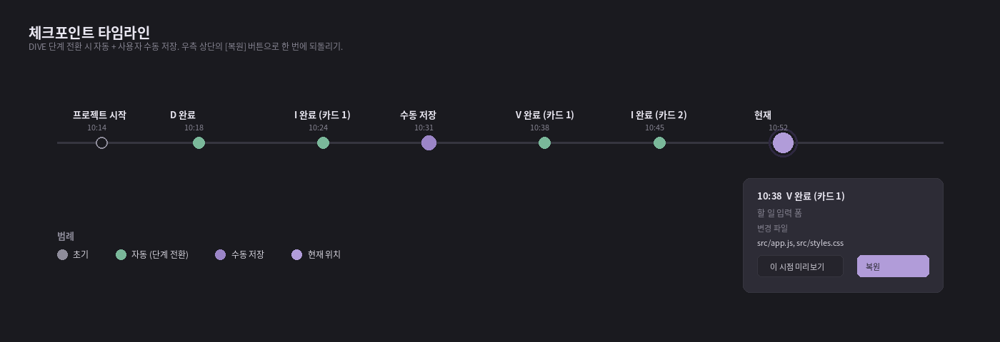
*그림 13. 체크포인트 타임라인*

#### 5.8.1 위치 및 동작

- 슬라이드 인 패널 하단에 가로 띠로 표시 (또는 메뉴에서 호출)
- 각 점은 하나의 체크포인트 = 하나의 git 커밋
- 점 호버 시 툴팁 — 시각, 종류, 변경된 파일
- 점 클릭 시 미리보기 모달 — 코드 상태 보기, [복원] 버튼
- 복원 시: 현재 상태도 자동 체크포인트로 저장 후 선택 시점으로 이동

#### 5.8.2 체크포인트 종류

| 종류 | 발생 시점 | 시각 |
|---|---|---|
| `init` | 프로젝트 생성 시 1회 | 회색 외곽선 원 |
| `auto` | DIVE 단계 전환 시 (D→I, I→V, V 통과, V 거부, E 진입) | 초록 채워진 원 |
| `manual` | 사용자가 [지금 저장] 버튼 클릭 | 보라 채워진 원 |
| `current` | 현재 상태 (가장 최근) | 민트 + 외곽 글로우 |

### 5.9 프로바이더 설정 화면

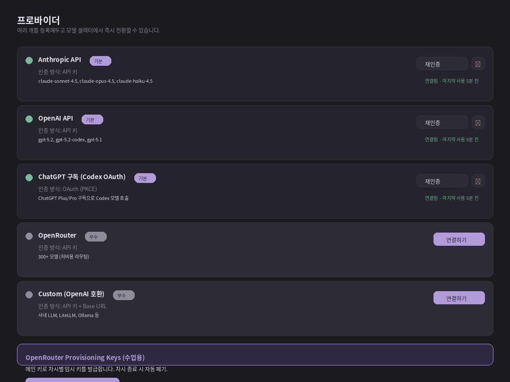
*그림 14. 프로바이더 설정*

#### 5.9.1 각 프로바이더 카드

- 이름 + tier 뱃지 (기본/부수)
- 인증 방식 표시
- 지원 모델 목록 (간단한 라벨)
- 연결 상태 점 (초록=정상, 회색=미연결, 빨강=인증 만료)
- [연결하기] / [재인증] / [✕ 연결 해제] 버튼
- 마지막 사용 시각 표시

#### 5.9.2 OpenRouter Provisioning Keys 섹션

- OpenRouter가 연결된 경우에만 활성화
- "수업용 임시 키 발급" 기능 — 차시별 토큰 한도가 부여된 자식 키 발급
- 발급된 키 목록 — 발급 시각, 한도, 사용량, 폐기 버튼
- 상세는 [§7.5](#75-openrouter-부수)

---

## 6. 핵심 기능 명세

### 6.1 프로젝트 관리

#### 생성
- "+ 새 프로젝트" 버튼 클릭 시 폴더 선택 다이얼로그가 열린다.
- 빈 폴더 또는 기존 폴더(코드가 이미 있는) 모두 선택 가능.
- 선택된 폴더에 `.dive/` 디렉터리가 자동 생성된다.
- 이미 `.dive/` 디렉터리가 있는 폴더는 "기존 프로젝트 열기"로 처리된다 (마이그레이션 없이 바로 사용).

#### 전환
- 사이드바의 프로젝트 목록에서 클릭하면 즉시 전환된다.
- 전환 시 현재 작업이 자동 저장된다 (DB와 git 둘 다).

#### 삭제
- "프로젝트 삭제"는 사이드바 우클릭 → 컨텍스트 메뉴.
- 확인 다이얼로그 — "프로젝트 폴더의 파일은 그대로 유지되고, `.dive/` 폴더만 제거됩니다." 체크박스 옵션으로 "코드 폴더도 함께 삭제" 선택 가능 (위험).

#### 가져오기·내보내기
- 가져오기 — 다른 PC에서 만든 `.dive/` 폴더가 포함된 프로젝트 폴더를 그대로 복사해 열면 됨. 별도 import 절차 없음.
- 익명화 export — 후속 분석을 위한 JSONL 파일 생성. [§9.4](#94-데이터-프라이버시) 참조.

### 6.2 세션 관리

#### 세션 정의
한 프로젝트 내에서 하나의 작업 흐름. v0.3 Plan-first 흐름에서 세션은 **Step 1개당 1개**(Step Open 시 자동 생성, `StepSessionMapping`으로 연결)가 권장 경로다. 같은 프로젝트에서 여러 세션을 만들 수 있고(Step 매핑 외에도 자유 세션 가능), 각 세션은 독립된 카드 진행 상태와 대화 컨텍스트를 가진다.

#### 생성·전환·아카이브
- **Step 기반 생성 (권장)** — Roadmap에서 Step의 [열기]를 누르면 매핑된 Session이 없으면 자동 생성, 있으면 재사용.
- **+ 새 세션 (자유)** — 사이드바의 [+ 새 세션] 버튼. Step 매핑 없는 자유 세션. v0.3에서는 Plan 흐름 외 임시 작업·실험용으로만 사용 권장.
- 세션 제목은 매핑된 Step 제목(있으면) 또는 첫 메시지로부터 자동 생성된다 (모델 호출 1회).
- 사용자가 직접 세션 제목 변경 가능.
- 사이드바 세션 목록에서 클릭 시 전환.
- 세션 우클릭 → "닫기"로 closed 상태로 변경 (사이드바에서 회색으로 표시).
- 아카이브된 세션도 검색·복원 가능.

#### 카드 컨텍스트
- 한 세션 내의 카드들은 같은 대화 히스토리를 공유한다.
- 단, AI에게 보내는 시스템 프롬프트는 현재 활성 카드 정보를 포함한다.
- 카드를 전환하면 채팅 입력란이 해당 카드 컨텍스트로 바뀌지만, 이전 카드의 메시지는 히스토리에 남아 AI가 참조 가능.

### 6.3 도구 시스템

#### 6.3.1 내장 도구 (v1.0)

| 도구 | 용도 | 위험도 |
|---|---|---|
| `read_file` | 파일 내용 읽기 | 안전 |
| `list_dir` | 디렉터리 목록 조회 | 안전 |
| `search_files` | 파일·내용 검색 | 안전 |
| `write_file` | 새 파일 생성 | 주의 |
| `edit_file` | 기존 파일 부분 수정 | 주의 |
| `mkdir` | 디렉터리 생성 | 주의 |
| `delete_file` | 파일 삭제 | 위험 |
| `bash` | 쉘 명령 실행 | 위험 |
| `run_process` | 특정 프로세스 실행 | 위험 |
| `web_search` | 웹 검색 | 안전 |
| `web_fetch` | URL 내용 가져오기 | 주의 |
| `mcp_*` | MCP 서버 도구 | 도구별 설정 |

#### 6.3.2 MCP (Model Context Protocol) 지원

- v1.0부터 MCP 서버 연결 지원.
- Rust crate `rmcp` 사용.
- stdio 방식 (로컬 서버) + streamable HTTP 방식 (원격) 둘 다 지원.
- 설정 화면에서 MCP 서버 URL 또는 명령을 등록.
- 등록된 MCP 도구는 권한 카드 흐름을 동일하게 거친다 — 위험도는 도구별 설정 가능.
- 교사가 만든 학습용 MCP 서버 (예: 채점 검증, 출제 도우미)를 학생이 가져다 쓰는 시나리오 가능.

#### 6.3.3 도구 호출 흐름

1. AI가 모델 응답에서 `tool_calls`를 반환
2. Agent Loop가 도구 호출을 감지
3. Permission Hook이 인터셉트 → 위험도 분류 → 권한 카드를 UI로 전송
4. 사용자 승인 후 → 차단 명령 블록리스트 검사 → Tool Registry가 도구 실행
5. 실행 결과를 메시지에 추가 → 모델 재호출
6. 변경된 파일이 있으면 자동 체크포인트 후보로 등록

### 6.4 권한 시스템

#### 6.4.1 권한 결정 우선순위

1. **차단 명령 블록리스트** — 항상 최우선 (어떤 설정으로도 우회 불가)
2. **사용자 자동 승인 정책** — 안전 도구 한정으로 사용자가 옵트인
3. **수동 승인 (기본값)** — 모든 도구는 카드를 통한 승인 필요

#### 6.4.2 자동 승인 가능한 도구

- `read_file`, `list_dir`, `search_files` (안전 — 읽기 전용)
- 주의·위험 도구는 자동 승인 옵션 자체를 제공하지 않음
- 다음 차시에는 정책 초기화 가능 (학습 환경에서 매 차시 새로 시작)

#### 6.4.3 권한 카드 거부 시 흐름

- AI는 거부 사유를 메시지로 받는다 — "사용자가 이 도구 호출을 거부했습니다. 다른 방법을 시도하거나 사용자에게 다시 확인하세요."
- AI는 자동으로 다른 접근을 시도하거나 사용자에게 질문한다.
- 동일 도구를 같은 인자로 3회 거부당하면 AI는 자동으로 사용자에게 명확화 질문을 한다 (무한 시도 방지).

### 6.5 체크포인트 시스템

#### 6.5.1 저장 메커니즘

- 각 프로젝트의 `.dive/git/` 디렉터리에 베어 git 저장소를 둔다.
- 체크포인트는 git 커밋 — 사용자 git 사용 여부와 독립적.
- Rust 라이브러리 `git2-rs` 사용.
- 커밋 메시지는 자동 생성 — `[D 통과] 카드 4개 작성`, `[I 통과] 입력 폼 만들기 - localStorage 추가` 등.

#### 6.5.2 자동 트리거

- D 단계 통과 (카드 추가 + 사용자 [다음 단계] 클릭)
- I 단계 통과 (각 카드별)
- V 단계 통과 (각 카드별, 최종 승인 시)
- V 단계 거부 (Rejected 상태로 변경 시 — 복구용)
- E 단계 진입

#### 6.5.3 수동 트리거

- 슬라이드 인 패널 우측 [지금 저장] 버튼
- `Ctrl+S` 단축키
- 수동 체크포인트는 라벨 입력 가능

#### 6.5.4 복원

1. 타임라인의 점 클릭 → 미리보기 모달
2. 미리보기 모달에서 변경된 파일과 상태 확인
3. [복원] 클릭 시 — 현재 상태를 자동 체크포인트로 저장(라벨: "복원 직전")
4. 선택 시점으로 git checkout 수행
5. UI 상태도 그 시점으로 동기화 (Roadmap Step 상태, 활성 카드 등)

#### 6.5.5 체크포인트의 한계

- git이 추적하는 것은 파일 시스템 변경뿐.
- 실행 결과(데이터베이스 변경, 외부 API 호출 결과)는 복원되지 않음.
- 네트워크 요청, 이메일 발송 등 비가역 동작은 복원 불가 — 권한 카드의 "위험" 분류로 사전 경고.

### 6.6 프롬프트 도우미

#### 6.6.1 템플릿 라이브러리

현재 DIVE 단계에 따라 적절한 템플릿을 보여준다.

| 단계 | 템플릿 예시 |
|---|---|
| D | "[기능]을 만들고 싶어. 작은 단위로 분해해줘.", "이 프로젝트의 큰 그림을 먼저 잡아줘." |
| I | "[현재 카드]만 작업해줘. 다른 부분은 건드리지 마.", "이 부분의 입력과 출력 예시를 먼저 알려줘." |
| V | "이 카드의 동작을 어떻게 검증할 수 있어?", "테스트 케이스 3개로 확인해줘." |
| E | "전체 코드를 검토하고 통합 시 문제될 부분을 알려줘." |

#### 6.6.2 실시간 모호함 감지

- 입력 중 (debounced 500ms) 모호한 표현을 감지
- 지시 대명사 ("이거", "그것", "저번 거"), 주어 생략, 단수/복수 모호 등
- 하이라이트 + 작은 힌트 — "어떤 버튼인지 명시해주세요"
- 정규식 + 휴리스틱으로 구현, 외부 호출 없음 (개인정보 보호)

#### 6.6.3 보내기 전 점검 (옵션)

- 입력란 우측 작은 버튼
- 클릭 시 AI가 사용자 프롬프트를 자체 비평
- "이 프롬프트의 모호한 부분: ..., 보완 제안: ..."
- 사용자는 제안을 적용하거나 무시
- 이 기능은 모델 호출 1회를 추가 소비 — 사용 시 토큰 사용량 표시

### 6.7 익명화 export (후속 분석용)

#### 6.7.1 목적

연구 성과 평가, 학습 효과 분석, 후속 논문 작성을 위한 데이터 추출. 개인 식별 정보를 제거한 JSONL 형식.

#### 6.7.2 export 절차

1. 설정 → "데이터 내보내기" → 차시(세션) 선택
2. 마스킹 옵션 선택 — 사용자 ID 해시화, 카드 본문 일부 또는 전체 포함, 코드 본문 포함 여부
3. JSONL 파일이 생성되어 사용자 PC에 저장

#### 6.7.3 export 데이터 스키마 (예시)

```jsonl
{"event":"session_start","ts":1735000000,"sid":"a1b2","uid":"hash_xxx"}
{"event":"stage_enter","ts":...,"sid":"a1b2","stage":"D"}
{"event":"card_create","ts":...,"sid":"a1b2","card":"c01","title_len":18}
{"event":"stage_exit","ts":...,"sid":"a1b2","stage":"D","duration_ms":420000,"cards":4}
{"event":"tool_call","ts":...,"sid":"a1b2","tool":"edit_file","approved":1,"latency_ms":2300}
{"event":"verify_result","ts":...,"sid":"a1b2","card":"c01","ai_pass":1,"user_approve":1}
```

- 카드·메시지 본문 포함 옵션은 별도 동의 절차 (마지막 단계에 명시적 체크박스).
- `uid`는 학번 해시 (사용자가 입력한 학번을 SHA-256으로 변환, 원본 저장 안 함).

---

## 7. 인증 및 프로바이더

### 7.1 프로바이더 추상화 — LlmProvider Trait

모든 프로바이더는 동일한 trait를 구현한다. 이로써 새 프로바이더 추가 시 어댑터 1개만 작성하면 된다.

```rust
#[async_trait]
pub trait LlmProvider: Send + Sync {
    fn id(&self) -> &str;
    fn list_models(&self) -> Vec<ModelInfo>;
    async fn chat(&self, req: ChatRequest)
        -> Result<BoxStream<'_, ChatEvent>>;
    async fn refresh_auth(&mut self) -> Result<()>;
}
```

내부 정규화 형식은 OpenAI Chat Completions shape으로 통일한다 — OpenRouter·OpenAI는 그대로, Anthropic·Codex는 어댑터에서 변환.

### 7.2 Anthropic API

- 인증: `x-api-key` 헤더, `anthropic-version` 헤더
- 엔드포인트: `POST https://api.anthropic.com/v1/messages`
- 스트리밍: SSE
- 변환 필요 — Anthropic은 `messages` 안에 `system`이 별도 필드, `tools` 형식이 OpenAI와 다름
- 지원 모델: `claude-sonnet-4.5`, `claude-opus-4.5`, `claude-haiku-4.5` 등 (앱 내 모델 카탈로그에서 자동 가져오기)

### 7.3 OpenAI API

- 인증: `Authorization: Bearer` 헤더
- 엔드포인트: `POST https://api.openai.com/v1/chat/completions`
- 변환 불필요 — 정규화 형식과 동일
- 지원 모델: `gpt-5.2`, `gpt-5.2-codex`, `gpt-5.1` 등

### 7.4 ChatGPT 구독 (Codex OAuth)

#### 동작
사용자의 ChatGPT Plus·Pro·Team·Enterprise 구독을 통해 모델 호출. PKCE 기반 OAuth 흐름이며 client secret이 필요 없어 데스크톱 앱에 적합하다.

#### 인증 흐름

1. 사용자가 [ChatGPT 구독 연결] 클릭
2. PKCE verifier·challenge 생성
3. 시스템 브라우저에서 `https://auth.openai.com/oauth/authorize` 열기
4. `localhost:1455`에 콜백 서버 (axum) 실행
5. 사용자가 브라우저에서 ChatGPT 로그인 → 콜백으로 code 수신
6. `POST https://auth.openai.com/oauth/token`으로 토큰 교환
7. `access_token`, `refresh_token`, `id_token` 수신
8. `id_token` JWT를 디코드해 `accountId` 추출
9. Keyring에 저장 (Windows Credential Manager)

#### 호출 시 헤더

```
Authorization: Bearer <access_token>
ChatGPT-Account-ID: <account_id>
OpenAI-Beta: responses=v1
// 시스템 프롬프트 첫 부분에 Codex CLI와 동일한 prefix 필요
```

#### 자동 토큰 갱신

- 만료 5분 전 background task에서 갱신
- 파일 락(`fs2`) 사용 — 동시 갱신 race 방지
- 갱신 실패 시 사용자에게 재인증 요청 알림

> **⚠ 주의:** 이 인증 방식은 OpenAI가 third-party 사용을 공식 지원하지 않는다. Codex CLI 업데이트마다 어댑터가 깨질 가능성이 있으며, OpenAI가 차단하면 사용 불가능해진다. 따라서 fallback 옵션(다른 프로바이더로 자동 전환)을 마련한다.

### 7.5 OpenRouter (부수)

#### 일반 사용

- 인증: `Authorization: Bearer <api_key>`
- 엔드포인트: `POST https://openrouter.ai/api/v1/chat/completions`
- OpenAI 호환 — 변환 불필요
- 300+ 모델에 단일 키로 접근

#### Provisioning Keys (수업용 임시 키 발급)

OpenRouter는 mother key로 자식 키를 발급할 수 있는 API를 제공한다. DIVE는 이를 활용해 수업 시점에 학생 PC용 임시 키를 발급하고, 차시 종료 시 자동 폐기한다.

#### 흐름

1. 교사가 본인 OpenRouter 메인 키를 DIVE에 등록
2. "수업용 키 발급" 버튼 클릭 → 학생 수, 차시별 한도(예: 50,000 토큰) 입력
3. DIVE가 OpenRouter API에 자식 키 발급 요청 — 한도와 만료 시각 지정
4. 발급된 키를 QR 코드 또는 짧은 URL로 표시
5. 학생은 자기 PC의 DIVE에서 QR을 스캔하거나 URL을 입력해 키를 등록
6. 차시 종료 시 교사가 [폐기] 버튼 클릭 — 모든 자식 키 무효화

#### 데이터 구조

```json
// 자식 키 발급 응답
{
  "key": "sk-or-child-...",
  "limit": 50000,
  "expires_at": 1735200000,
  "label": "2026-08-15-period-3-student-A"
}
```

### 7.6 Custom (OpenAI 호환)

- 사내 LLM 게이트웨이, LiteLLM 프록시, Ollama 등을 등록 가능
- 필수 설정: `id`, `base_url`, `api_key`, 모델 목록(수동 입력 또는 `/v1/models` 자동 fetch)
- OpenAI 호환 API라면 추가 변환 없이 동작

### 7.7 키와 토큰 저장

- Windows: Credential Manager (`keyring` crate)
- macOS·Linux: 추후 지원 — 각 OS의 표준 keychain
- **평문 저장은 절대 금지**
- OAuth 토큰도 동일 — `refresh_token`은 매우 민감하므로 keyring 외 저장 금지

---
## 8. 도구 시스템 — 상세

### 8.1 도구 호출 시퀀스

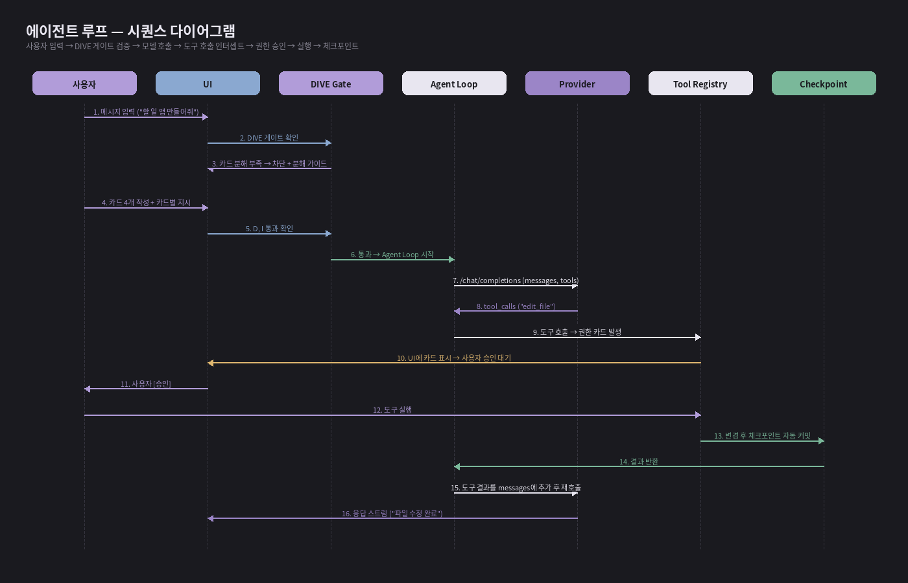
*그림 15. 에이전트 루프 시퀀스 — 사용자 입력부터 체크포인트까지*

### 8.2 Agent Loop 의사코드

```rust
// 의사코드 — 실제 Rust 구현은 더 복잡
loop {
    let req = build_chat_request(messages, tools, current_card);

    // DIVE 게이트
    dive_gate.check(&req).map_err(|e| return UI::block(e))?;

    // 모델 호출 (스트리밍)
    let mut stream = provider.chat(req).await?;
    let mut tool_calls = vec![];

    while let Some(event) = stream.next().await {
        match event {
            ChatEvent::TextDelta(t) => ui.append_text(t),
            ChatEvent::ToolCall(tc) => tool_calls.push(tc),
            ChatEvent::Done(_) => break,
        }
    }

    if tool_calls.is_empty() { break; }

    // 도구 실행 — 권한 카드 거치기
    for tc in tool_calls {
        let perm = permission_hook.intercept(&tc).await?;
        if perm.approved {
            blocklist.check(&tc)?;
            let result = tool_registry.run(tc).await?;
            messages.push(Message::tool_result(result));
            checkpoint.maybe_create(&tc).await;
        } else {
            messages.push(Message::tool_rejected());
        }
    }
}
```

### 8.3 자동 승인 정책

#### 정책 데이터 모델

```json
{
  "auto_approve": {
    "read_file": "always",
    "list_dir": "always",
    "search_files": "always",
    "edit_file": "never",
    "bash": "never"
  }
}
```

#### 정책 우선순위 (위→아래로 검사)

1. 블록리스트 위반 → 즉시 거부 (사용자 승인도 불가)
2. 도구별 자동 승인 정책 → 적용
3. 수동 승인 (기본)

#### 정책 변경 위치

- 설정 → 권한 → 도구별 자동 승인 토글
- 주의·위험 도구의 토글은 회색으로 disabled (변경 불가)
- 변경 사항은 즉시 반영, 진행 중인 도구 호출에는 영향 없음

### 8.4 Tool Registry 구현

```rust
#[async_trait]
pub trait Tool: Send + Sync {
    fn name(&self) -> &str;
    fn description(&self) -> &str;
    fn input_schema(&self) -> serde_json::Value;
    fn risk_level(&self) -> RiskLevel;
    async fn run(&self, input: Value, ctx: &ToolContext)
        -> Result<ToolOutput>;
}

pub enum RiskLevel { Safe, Warn, Danger }

pub struct ToolContext<'a> {
    project_root: &'a Path,
    session_id: &'a str,
    fs: &'a FsGuard,        // 블록리스트·경로 제한 적용
    proc: &'a ProcGuard,
}
```

### 8.5 MCP 통합

#### MCP 서버 등록
- 설정 → MCP → "서버 추가"
- **stdio**: 명령(예: `npx @modelcontextprotocol/server-filesystem`) + args + env
- **streamable HTTP**: URL + 인증 헤더

#### MCP 도구의 위험도 결정
- 서버 등록 시 사용자가 도구별 위험도를 지정 (또는 일괄 설정)
- MCP 서버가 메타데이터에 위험도 힌트를 제공하면 그것을 사용 (rmcp 표준 확장)
- 지정되지 않으면 기본값 "주의"

#### MCP OAuth (대비)
- 일부 MCP 서버는 OAuth 인증 필요
- rmcp의 streamable HTTP + OAuth 지원 사용
- 인증 토큰은 keyring 저장

---

## 9. 보안 및 안전장치

### 9.1 권한 카드 강제 (default ON)

- 모든 도구 호출은 기본적으로 권한 카드를 거친다.
- 자동 승인은 안전 도구(read 계열)만 옵트인.
- 빌드 시점에 강제되며 빌드 플래그 외에는 끌 수 없다.

### 9.2 차단 명령 블록리스트

이 패턴들은 사용자 승인을 받았다 하더라도 실행되지 않는다. 학생 PC에서 실수든 의도든 시스템을 망가뜨리는 것을 막기 위한 최후의 방어선.

#### 절대 차단 패턴 (예시)

```bash
# 파괴적 시스템 명령
rm -rf /
rm -rf /*
rm -rf ~
rm -rf ~/*
rmdir /s /q C:\
format C:
del /f /s /q C:\*

# 디스크 직접 쓰기
dd if=* of=/dev/sd?
mkfs.*

# 네트워크 + 실행 결합 (curl-pipe-bash)
curl * | bash
curl * | sh
wget * -O - | bash
iwr * | iex

# 권한 상승
sudo *
runas *
```

#### 정책

- 정규식 + AST 기반 매칭 (단순 문자열 매칭은 회피 쉬움)
- 차단 시 권한 카드도 표시되지 않고, 시스템 메시지로 사용자에게 알림
- 카탈로그는 앱 업데이트로 갱신
- 차단된 명령은 EventLog에 기록

### 9.3 파일 시스템 경로 제한

- write/edit/delete 도구는 프로젝트 루트 디렉터리 하위로만 동작 가능
- 홈 디렉터리, 시스템 디렉터리, 다른 프로젝트 폴더 접근 시도 시 자동 거부
- 상대 경로의 `..` 추적은 프로젝트 루트를 벗어나면 차단
- 심볼릭 링크는 따라가지 않음 (canonicalize 후 검사)

### 9.4 데이터 프라이버시

#### 수집 정책

- DIVE 자체는 사용자 데이터를 외부로 전송하지 않는다.
- AI 호출은 사용자가 등록한 프로바이더로만 직접 — DIVE 서버를 거치지 않음.
- 크래시 리포트, 사용 통계 등 텔레메트리는 v1.0 범위에 포함하지 않음.

#### 익명화 export 동의 절차

1. 데이터 내보내기 메뉴 → 차시 선택
2. 포함 항목 체크박스 — 메타데이터(필수), 카드 본문, 메시지 본문, 코드 변경 diff
3. "이 데이터는 후속 분석·연구 목적으로만 사용됩니다" 안내문 + 명시 동의 체크박스
4. SHA-256 해시 마스킹 적용 — 학번 등 식별자가 원본으로 저장되지 않음
5. 사용자가 직접 export한 파일을 어떻게 사용하는지는 사용자 책임

### 9.5 OAuth 토큰 보안

- `access_token`, `refresh_token` 모두 keyring(Windows Credential Manager)에만 저장
- 파일 시스템 평문 저장 금지
- refresh 시 동시성 제어 — 파일 락
- 갱신 실패 시 자동 로그아웃, 사용자에게 재인증 요청

### 9.6 에러 시 동작

#### 네트워크 단절
- AI 호출 실패 시 자동 재시도 3회 (지수 백오프 0.5s, 1s, 2s)
- 3회 실패 시 사용자에게 명시적 에러 — 다른 프로바이더로 전환 옵션 제시
- 도구 실행 결과는 큐에 보관되지 않음 — 재시도는 메시지 단위

#### 도구 실행 실패
- 도구 실행 중 에러 발생 시 결과를 stderr로 AI에게 전달
- AI가 자체 진단 후 다른 접근 시도
- 동일 카드 내 동일 도구 5회 연속 실패 시 사용자에게 강제 알림 — 무한 루프 방지

#### 체크포인트 충돌
- git 커밋 충돌은 발생하지 않음 (단일 사용자, 순차 작업)
- 이론적 race condition 대비 — 커밋 시 advisory lock

---

## 10. 데이터 모델

### 10.1 프로젝트 폴더 구조

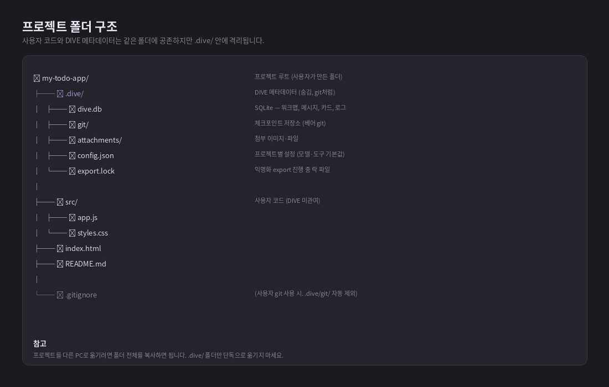
*그림 16. 프로젝트 폴더 구조 — `.dive/` 안에 모든 메타데이터 격리*

#### 설계 원칙

- 프로젝트 = 사용자 폴더 1개. DIVE 메타데이터는 그 폴더의 `.dive/` 안에 격리.
- git이 `.git/`을 다루는 방식과 동일 — 자체 완결적, 폴더 이동만으로 다른 PC에서 재현.
- 사용자 코드와 메타데이터의 명확한 분리 — 사용자가 `.dive/` 안을 건드릴 일이 없음.

### 10.2 SQLite 데이터 모델

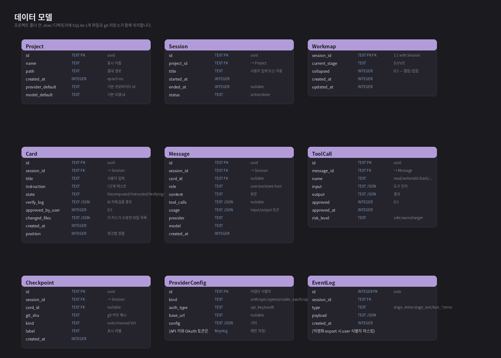
*그림 17. SQLite 스키마 — v0.3 기준 13개 엔티티 (Plan-first 4개 추가)*

#### 엔티티 요약

| 테이블 | 용도 | 주요 필드 |
|---|---|---|
| `Project` | 프로젝트 메타 | `id`, `name`, `path`, `provider_default`, `model_default` |
| `Interview` | 의도 인터뷰 (Plan 전 단계, project당 0..1) | `id`, `project_id`, `goal`, `questions` JSON, `unresolved_questions`, `intent_summary`, `status` (draft/submitted/approved/discarded) |
| `Plan` | 승인된 계획 (project당 0..1, Plan-first SoT) | `id`, `project_id`, `interview_id`, `goal`, `intent_summary`, `scope`, `non_goals`, `constraints`, `acceptance_criteria`, `status` (draft/approved), `approved_at` |
| `Step` | Plan의 작업 단위 | `id`, `plan_id`, `step_id` (slug), `title`, `summary`, `instruction_seed`, `expected_files`, `acceptance_criteria`, `verification_kind`, `verification_command`, `dependencies` JSON, `parallel_group`, `position` |
| `StepSessionMapping` | Step ↔ Session/Card 1:1 (선택적) | `id`, `step_id`, `session_id`, `card_id`, `status` (planned/blocked/ready/in_progress/review/done/shipped), `checkpoint_ids`, `verification_status`, `verification_evidence`, `user_decision` |
| `Session` | 세션 | `id`, `project_id`, `title`, `started_at`, `status` |
| `Workmap` | 세션 워크맵 상태 (legacy, v0.3에서 Roadmap이 1차 단위) | `session_id`, `current_stage`, `collapsed` |
| `Card` | 카드 (Step 실행 단위) | `id`, `session_id`, `title`, `instruction`, `state`, `verify_log`, `changed_files`, `position` |
| `Message` | 채팅 메시지 | `id`, `session_id`, `card_id`, `role`, `content`, `tool_calls`, `usage`, `provider`, `model` |
| `ToolCall` | 도구 호출 | `id`, `message_id`, `name`, `input`, `output`, `approved`, `risk_level` |
| `Checkpoint` | 체크포인트 | `id`, `session_id`, `card_id`, `git_sha`, `kind`, `label` |
| `ProviderConfig` | 프로바이더 설정 | `id`, `kind`, `auth_type`, `base_url`, `config` (API 키·OAuth 토큰은 keyring) |
| `EventLog` | 이벤트 로그 | `id`, `session_id`, `type`, `payload`, `created_at` |

#### Plan-first 엔티티 관계

```text
Project (1)
  ├── Interview (0..1)         [UNIQUE(project_id)]
  ├── Plan (0..1)              [UNIQUE(project_id)]
  │     └── Step (N)           [plan_id, position ASC]
  │           └── StepSessionMapping (0..1)
  │                 ├── Session (0..1)
  │                 └── Card (0..1)
  └── Session (N)
        ├── Workmap (1)
        ├── Card (N)
        ├── Message (N)
        ├── Checkpoint (N)
        └── EventLog (N)
```

> **SoT 정책 (ADR-080):** SQLite가 runtime 진실. `.dive/plan.json` / `plan.md` / `flow.mmd`는 `Plan.status = approved` 시점의 portable export이며, 충돌 시 SQLite가 우선한다.

### 10.3 카드 상태 enum

```rust
pub enum CardState {
    Decomposed,   // 카드 작성됨, 지시 없음
    Instructed,   // I 단계, 지시 작성됨
    Verifying,    // V 단계 진입, AI 자체검증 진행 중
    Verified,     // 사용자 최종 승인됨
    Rejected,     // 사용자 거부, I 단계로 회귀 가능
    Extended,     // E 단계에서 통합·확장 완료
}
```

### 10.4 ProviderConfig 저장 위치

- `id`, `kind`, `base_url` 등 비민감 설정은 SQLite의 `ProviderConfig` 테이블에 저장.
- API 키, OAuth `access_token`, `refresh_token`은 키링(Windows Credential Manager)에 저장.
- SQLite와 키링은 `ProviderConfig.id`를 키로 연결.
- 이렇게 분리하면 사용자가 `.dive/` 폴더를 다른 PC로 옮겨도 키는 자동으로 따라가지 않음 (의도된 동작).

### 10.5 EventLog (로그)

#### 기록되는 이벤트 종류
- `session_start` / `session_end`
- `stage_enter` / `stage_exit` (D/I/V/E별)
- `card_create` / `card_update` / `card_delete`
- `tool_call` / `tool_approve` / `tool_reject` / `tool_complete`
- `checkpoint_create` / `checkpoint_restore`
- `error_occurred` (네트워크·도구·게이트 차단 등)

#### payload 형식
- JSON 형태로 자유 스키마. 이벤트 종류별로 구조가 다름.
- 개인 식별 정보(코드 본문 등)는 기본적으로 미포함, export 시 옵션으로 추가.

---

## 11. 기술 아키텍처

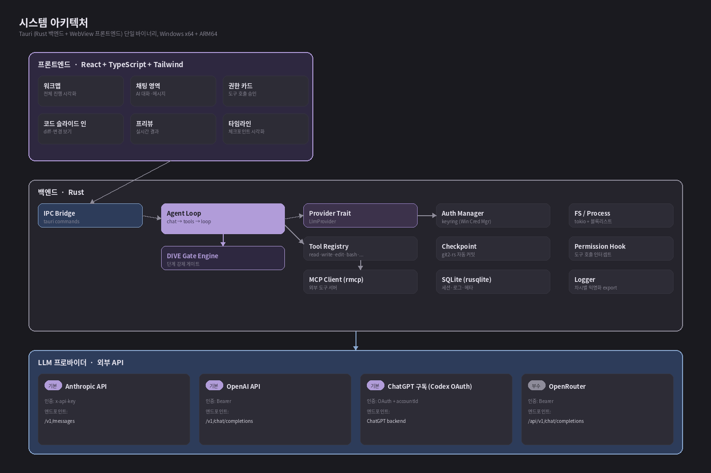
*그림 18. 시스템 아키텍처 — Tauri 단일 바이너리, 외부 LLM API 호출*

### 11.1 기술 스택 요약

| 영역 | 기술 |
|---|---|
| 데스크톱 프레임워크 | Tauri 2.x |
| 백엔드 언어 | Rust 1.80+ |
| 프론트엔드 | React 18 + TypeScript 5 |
| 스타일 | Tailwind CSS 3 |
| 상태 관리 | Zustand 또는 Jotai |
| diff 뷰어 | react-diff-viewer 또는 자체 구현 (Monaco 미사용) |
| 아이콘 | Lucide |
| 빌드 | Vite (프론트), cargo (백) |
| 패키징 | NSIS (Windows x64 + ARM64) |
| 테스트 | Rust: `cargo test`, FE: Vitest + Playwright |
| 로컬 저장 | SQLite (`rusqlite`) + `git2-rs` |
| 키링 | `keyring` crate |
| HTTP | `reqwest` |
| 비동기 | `tokio` |

### 11.2 Tauri 선택 이유

- 단일 바이너리 — 학생 PC 설치 부담 최소
- Rust 백엔드 — 보안·성능·강타입 안전성
- WebView 기반 UI — React 생태계 활용 가능, 디자인 자유도 높음
- Electron 대비 메모리·바이너리 사이즈 우수 (수십 MB vs 수백 MB)
- Windows ARM64 네이티브 지원 (`rustup target add aarch64-pc-windows-msvc`)

### 11.3 Windows x64 + ARM64 빌드

#### 타겟 추가

```bash
rustup target add x86_64-pc-windows-msvc
rustup target add aarch64-pc-windows-msvc
```

#### 빌드 명령

```bash
# x64
cargo tauri build --target x86_64-pc-windows-msvc

# ARM64
cargo tauri build --target aarch64-pc-windows-msvc --bundles nsis
```

> **⚠ 주의:** ARM64 빌드는 NSIS 번들만 가능 (MSI는 ARM64 미지원). x64는 둘 다 가능. 의존 라이브러리 중 ARM64 미지원이 있는지 사전 확인 필요(특히 `keyring`, `git2-rs`).

### 11.4 자체 에이전트 루프 구현 이유

#### Claude Agent SDK를 쓰지 않는 이유

- Claude SDK는 Anthropic API 전용. OpenAI·OpenRouter·Codex OAuth 등 멀티 프로바이더 지원이 핵심 요구사항이므로 부적합.
- 내부 정규화 형식을 OpenAI shape으로 통일하면 OpenAI·OpenRouter는 그대로, 그 외(Anthropic 등)는 어댑터에서 변환 — 멀티 프로바이더 비용 최소화.

#### Rust 라이브러리 선택

- `async-openai` — OpenAI 호환 API용 클라이언트, 직접 호출도 가능
- `reqwest` + `serde` — Anthropic·Codex OAuth 어댑터 직접 구현
- `rmcp` — MCP 클라이언트
- `git2-rs` — 체크포인트 (libgit2 바인딩)
- `rusqlite` — SQLite
- `keyring` — 키 저장 (Windows Credential Manager 추상화)
- `tokio` — 비동기 런타임

### 11.5 IPC (프론트엔드 ↔ 백엔드)

#### Tauri Commands
- 백엔드 함수를 `#[tauri::command]`로 노출, 프론트에서 `invoke()`로 호출
- 주요 commands — `chat_send`, `tool_approve`, `tool_reject`, `project_open`, `checkpoint_restore`, `provider_connect` 등

#### 이벤트 (단방향, 백→프)
- 스트리밍 응답·실시간 UI 갱신은 이벤트로
- `chat_message_delta`, `tool_call_started`, `checkpoint_created`, `stage_changed` 등

### 11.6 폴더 구조 (소스 트리)

```
dive/
├── src-tauri/                # Rust 백엔드
│   ├── src/
│   │   ├── main.rs
│   │   ├── agent/            # Agent Loop
│   │   ├── dive/             # DIVE Gate Engine, 카드 상태
│   │   ├── providers/        # LlmProvider 구현체들
│   │   │   ├── anthropic.rs
│   │   │   ├── openai.rs
│   │   │   ├── codex_oauth.rs
│   │   │   ├── openrouter.rs
│   │   │   └── custom.rs
│   │   ├── tools/            # 내장 도구들
│   │   ├── mcp/              # MCP 클라이언트
│   │   ├── auth/             # keyring 래퍼
│   │   ├── checkpoint/       # git2-rs 래퍼
│   │   ├── db/               # rusqlite 래퍼
│   │   └── ipc/              # Tauri commands
│   ├── tauri.conf.json
│   └── Cargo.toml
├── src/                      # React 프론트엔드
│   ├── components/
│   │   ├── product/          # ProductShell (3패널 그리드, RoadmapHost, ConversationPanel)
│   │   ├── roadmap/          # Roadmap 우측 패널 (Step 의존성 그래프, RoadmapGraph)
│   │   ├── workmap/          # (legacy) 카드 단위 워크맵 — Roadmap에 흡수 진행 중
│   │   ├── chat/             # 채팅 영역
│   │   ├── slide-in/         # 슬라이드 인 패널 (코드/미리보기/터미널/StepDetail)
│   │   ├── permission-card/  # 권한 카드
│   │   └── sidebar/          # 좌측 사이드바
│   ├── features/
│   │   ├── planning/         # Plan/Interview hooks & types
│   │   └── roadmap/          # usePlanRoadmap, derivePlanRoadmapSteps
│   ├── pages/
│   ├── hooks/
│   ├── stores/               # Zustand 또는 Jotai
│   ├── i18n/                 # ko/en JSON
│   └── main.tsx
├── package.json
└── vite.config.ts
```

---

## 12. 비기능 요구사항

### 12.1 성능

- **앱 시작**: 차가운 시작 3초 이내, 따뜻한 시작 1초 이내
- **메시지 입력 → 첫 토큰 표시**: 모델 응답 지연 외 추가 지연 200ms 이내
- **체크포인트 생성**: 평균 500ms 이내 (소형 프로젝트 기준)
- **메모리**: 유휴 상태 250MB 이하, 작업 중 700MB 이하
- **디스크**: 빈 프로젝트의 `.dive/` 폴더 1MB 이하

### 12.2 접근성

#### 키보드 접근
- 모든 액션은 키보드만으로 수행 가능
- 주요 단축키:
  - `Ctrl+N` — 새 프로젝트
  - `Ctrl+S` — 체크포인트
  - `Ctrl+/` — 프롬프트 도우미
  - `Ctrl+,` — 설정
  - `Ctrl+E` — 슬라이드 인 패널 토글 (코드/미리보기)
  - `Ctrl+W` — Roadmap 펼침/접힘 토글
- Roadmap Step 노드 탐색 — `↑` / `↓`으로 상하 이동, `Enter`로 진입 (Tab은 패널 간 포커스 이동)
- 권한 카드 — `A`(승인), `R`(거부), `E`(편집)

#### 스크린 리더
- 주요 영역에 ARIA 라벨
- 상태 변경 시 `aria-live` 영역으로 알림
- 아이콘 전용 버튼은 `aria-label` 필수

#### 색상 대비
- 본문 텍스트 4.5:1 이상 (WCAG AA)
- 주요 액션 버튼 3:1 이상
- 색상만으로 의미 전달하지 않음 — 위험도 표시는 색 + 아이콘 + 텍스트

### 12.3 다국어 (i18n)

- 한국어 (ko-KR), 영어 (en-US) 동등 지원
- 첫 실행 시 OS 언어 감지
- 번역 리소스는 `src/i18n/` 아래 `ko.json`, `en.json`
- AI 시스템 프롬프트도 언어별로 분기

### 12.4 네트워크 정책

#### 재시도 정책
- AI 호출 실패: 자동 재시도 3회, 지수 백오프 (0.5s, 1s, 2s)
- 3회 후 사용자에게 명시 에러 — 다른 프로바이더로 즉시 전환 옵션
- OAuth 토큰 갱신 실패: 자동 재시도 1회 후 사용자 재인증 요청

#### 타임아웃
- 일반 API 호출: 60초
- 스트리밍 응답: 첫 토큰까지 30초, 토큰 간 60초
- 도구 실행: bash 도구 기본 30초 (사용자가 인자로 변경 가능)

#### 프록시
- OS 프록시 설정 자동 사용 (시스템 프록시 inherit)
- 수동 프록시 설정도 지원 — 설정 → 네트워크

### 12.5 로깅

- Rust: `tracing` crate 사용, 파일 로테이션
- 로그 위치: `%APPDATA%\dive\logs\dive.log`
- 기본 레벨 INFO, 디버그 빌드는 DEBUG
- 민감 정보(키, 토큰, OAuth 코드) 로그 출력 금지 (마스킹)

### 12.6 자동 업데이트

- v1.0 범위에서는 수동 다운로드 (배포는 GitHub Releases)
- v1.1 이후 Tauri Updater로 자동 업데이트 검토
- 업데이트 시 `.dive/` 폴더는 보존 (앱 데이터와 사용자 데이터 분리)

---

## 13. 로드맵 및 우선순위

### 13.1 마일스톤 개요

| 시기 | 버전 | 범위 |
|---|---|---|
| 5월 | — | 선행 연구 + 기술 스파이크 + 학생 인증 구조 PoC + **Phase 9 Plan-first 데이터 모델 (ADR-080~083)** |
| 6월 | v0.1 | 예비 수업 + 워크맵 + 채팅 + 권한 카드 |
| 7월 | v0.2 | 검증 게이트 + 체크포인트 + 블록리스트 + 수업 자료 |
| **8월 초** | **v0.2** | **광교고 파일럿 6차시 (핵심 데드라인)** |
| 9월 | v0.2.1 | 파일럿 보완 + 토평고 검증 |
| 10월 | **v0.3** | **Plan-first 흐름 정식 도입 (Interview → Plan → Step Roadmap → Build → Extend)** + Codex OAuth + MCP + 학술대회 + 워크숍 |
| 11~12월 | v1.0 | 다국어·접근성 보완 + 오픈소스 공개 + 결과보고서 |

### 13.2 5월 — 선행 연구 + 기술 스파이크

#### 산출물
- 선행 연구 정리 (바이브 코딩 교육 + AI 코딩 에이전트 사용성 연구 검토)
- Tauri + Rust 기술 스파이크 — Hello World 빌드, Windows x64/ARM64 양쪽 빌드 검증
- LLM 호출 스파이크 — Anthropic·OpenAI 직접 호출, 정규화 형식 변환 검증
- 학생 인증 구조 결정 — OpenRouter Provisioning Keys 검증, 자식 키 발급·폐기 흐름 PoC

#### 의사결정 포인트
- Codex OAuth 어댑터 작성 시점 — v0.3까지 미루는 안 vs v0.1부터 포함하는 안. 본 명세는 v0.3로 미루는 안을 따른다 (8월 파일럿에는 Anthropic·OpenAI·OpenRouter만).

### 13.3 6월 — 예비 수업 + v0.1

#### v0.1 핵심 기능 (8월 파일럿 진입 직전 검증용)
- 프로젝트 관리 — 생성·열기·삭제
- 세션 관리 — 1프로젝트 다세션
- **워크맵 하단 가로 띠** — D 단계 카드 분해 (수동 작성 + AI 도움), 펼침/접힘
- 채팅 영역 (메인 작업 공간) — 메시지 송수신, 스트리밍
- **슬라이드 인 패널** — 코드 / 미리보기 탭
- 권한 카드 — 위험도 분류, 수동 승인, diff 표시
- 프로바이더 선택 — Anthropic / OpenAI / OpenRouter (Codex OAuth는 v0.3)

#### 보류 (v0.2 이후)
- I → V 게이트 강제 (이때까지는 사용자 자율)
- 자동 체크포인트 (수동 git commit으로 대체)
- 익명화 export (로그만 jsonl로 저장)

### 13.4 7월 — v0.2 + 수업 자료

#### v0.2 추가 기능
- I·V·E 단계 강제 게이트 도입
- AI 자체 검증 + 사용자 최종 승인 (V 단계)
- 자동 + 수동 체크포인트 (`git2-rs`)
- 차단 명령 블록리스트 v1
- 익명화 export 기본 구조

#### 수업 자료
- 지도안 6차시 (양회욱 교사 — 어정중 baseline에서 일반화)
- 학생 활동지 (김나영 교사 — 토평고 보조 검증 포함)
- 교사용 운영 매뉴얼 (고규현)

### 13.5 8월 초 — 광교고 파일럿 (핵심 데드라인)

#### 규모
- 대상: 광교고등학교 선택 과목 수강생 (예상 25명)
- 차시: 6차시 (90분 × 6)
- 환경: 학교 PC + 학생 개인 노트북 혼합 가능

#### 측정
- 자동 측정 — DIVE 단계별 소요 시간, 카드 수, 재시도 횟수, 도구 호출 분포, 권한 카드 거부율
- SUS (학생용) — 6차시 종료 후 설문
- 산출물 평가 — 차시별 완성도 + 코드 품질 (실행 가능 여부, 카드별 검증 통과율)

#### 필수 기능 (이 시점에 반드시 동작)
- 프로젝트·세션 관리
- DIVE 4단계 강제
- 워크맵 + 슬라이드 인 패널
- Anthropic·OpenAI·OpenRouter 프로바이더
- OpenRouter Provisioning Keys (학생 키 분배)
- 권한 카드 + 차단 명령 블록리스트
- 자동 + 수동 체크포인트
- 익명화 export

### 13.6 9월 — 보완 + 토평고 검증

- 파일럿 데이터 분석 → v0.2.1 패치 (UX 보완)
- 토평고 보조 검증 (김나영 교사) — 다른 학교 환경에서 같은 흐름 재현 가능 여부
- SUS 설문 + 면담 결과 정리

### 13.7 10월 — v0.3 + 학술대회

- **Plan-first 흐름 정식 도입** ([§4.1](#41-상위-계층--workspace-plan-흐름))
  - Interview → Plan draft → 기능 명세서 + mermaid 승인 → Step Roadmap → Build → Extend 전체 경로 활성화
  - Phase 9 데이터 모델(Interview/Plan/Step/StepSessionMapping) 위에서 IPC + UI 정합
  - `.dive/plan.json`/`plan.md`/`flow.mmd` portable export 안정화
- "워크맵" 용어를 UI에서 제거 — Roadmap 패널이 1차 진행 시각화
- Codex OAuth 어댑터 추가
- MCP 서버 통합 (학생용 도구 노출 포함)
- 학술대회 발표 (한국컴퓨터교육학회 또는 KAEIM)
- 교사 워크숍 — 정보 교과 협의회 발표

### 13.8 11~12월 — v1.0 정식 + 결과보고서

- v1.0 — 다국어 (영어 추가), 다크모드, 접근성 보완 마무리
- GitHub 오픈소스 공개 (라이선스 선택 — MIT 우선 검토)
- 결과보고서 작성 — 정량(자동 측정) + 정성(SUS, 면담)
- 후속 연구·확장 제안

### 13.9 연구진 역할 분담

| 연구원 | 소속 | 주요 역할 |
|---|---|---|
| 고규현 (총괄) | 광교고등학교 | 제품 개발 · 광교고 파일럿 운영 · 명세·문서 총괄 |
| 김나영 | 토평고등학교 | 학생 활동지 · 학술 발표 · 보조 검증 |
| 양회욱 | 어정중학교 | 지도안 작성 · 중학교 baseline 검증 |
| 이장원 교수 (자문) | 경인교대 컴퓨터교육과 | 학술 자문 · 연구 설계 검토 · 논문 지도 |

---

## 14. 후속 결정 항목 (TBD)

현재 명세에서 단정적으로 결정하지 않은 항목들. 추후 협력 교사 및 자문 교수 검토 후 결정한다.

### 14.1 라이선스

- MIT 우선 검토 — 가장 자유로운 OSS 라이선스, 학교·기업 모두 사용 가능
- Apache 2.0 대안 — 특허 조항 명시 필요 시
- AGPL 검토 — 상용 클라우드 fork 방지가 필요한 경우 (현 시점에는 무리)
- 의존 라이브러리 라이선스 호환성 사전 확인 필요

### 14.2 다인 협업·교사 대시보드

- 현 v1.0 범위에는 포함하지 않음
- 교사가 학생 진행 상황을 실시간 모니터링하는 기능은 큰 인프라(서버) 요구 — 데스크톱 앱 범위 초과
- 대안: 익명화 export 사후 분석 (각 차시 종료 후 학생이 .jsonl 파일을 LMS에 업로드, 교사가 일괄 분석)
- 이 모델은 교사 부담을 줄이고 학생 사생활도 보호
- 실시간 대시보드는 v2.0 또는 별도 프로젝트로 분리 검토

### 14.3 macOS·Linux 지원

- v1.0은 Windows 우선 (학교 보급률 기준)
- Tauri는 macOS·Linux 멀티플랫폼 지원 — 큰 추가 작업 없이 빌드 가능
- `keyring` crate가 macOS·Linux 표준 키링도 추상화 — 코드 변경 최소
- 단, 광범위한 QA가 필요하므로 v1.1 또는 후속 분기에서

### 14.4 모바일·웹 버전

- 데스크톱 우선 설계 — 코드 작성·실행이 핵심 가치이므로 모바일 부적합
- 웹 버전은 보안 모델이 본질적으로 다름 (브라우저 sandbox vs 데스크톱 file access) — 별도 설계 필요
- 현 단계에서는 검토하지 않음

### 14.5 텔레메트리 (사용 통계)

- v1.0 범위에서 미포함 (개인정보 보호 우선)
- 익명화된 사용 통계(예: DIVE 단계별 평균 소요 시간 분포)는 후속 연구에 가치가 있음
- 도입한다면 명시적 옵트인 + 차등 프라이버시 적용 검토
- 익명화 export로 충분한지 vs 별도 텔레메트리가 필요한지 평가 필요

### 14.6 v1.0 이후 검토 기능

- 교사 대시보드 (서버 백엔드 필요) — v2.0 또는 별도 프로젝트
- 영상 튜토리얼 자동 재생 (DIVE 단계별 가이드)
- 학생 간 카드 공유 (P2P) — 동료 학습
- AI가 만든 코드 자동 주석화 (학습용 설명 추가)
- git remote 푸시 워크플로우 통합 (DIVE 외부 git과의 충돌 처리)
- 성취도 추적 (개인 진행 그래프, 게이미피케이션은 신중히)

---

## 부록 A. Codex 작업 시작 가이드

이 명세서는 Codex 또는 다른 AI 코딩 에이전트가 DIVE 구현을 시작할 수 있도록 작성되었다. 다음 순서로 작업하는 것을 권장한다.

### A.1 권장 작업 순서 (5월 — 기술 스파이크)

1. **Tauri 2.x + React + TypeScript 보일러플레이트 생성**
   ```bash
   cargo install create-tauri-app
   cargo create-tauri-app dive --template react-ts
   ```
2. **Windows ARM64 빌드 검증** — `rustup target add aarch64-pc-windows-msvc`로 빌드 확인 ([§11.3](#113-windows-x64--arm64-빌드))
3. **`LlmProvider` trait 정의 + Anthropic·OpenAI 어댑터** ([§7.1](#71-프로바이더-추상화--llmprovider-trait))
4. **OpenRouter Provisioning Keys API PoC** — 자식 키 발급·폐기 흐름 검증 ([§7.5](#75-openrouter-부수))
5. **SQLite 스키마 생성** — `Project` / `Session` / `Workmap` / `Card` / `Message` 5개 테이블부터 ([§10.2](#102-sqlite-데이터-모델))

### A.2 v0.1 (6월) 우선 구현 영역

| 영역 | 파일 위치 | 핵심 기능 |
|---|---|---|
| Agent Loop | `src-tauri/src/agent/` | [§8.2 의사코드](#82-agent-loop-의사코드) 기반 |
| DIVE Gate | `src-tauri/src/dive/` | D 단계 게이트만 강제 (I→V→E는 v0.2, Plan/Interview 모드는 v0.3) |
| 워크맵 UI (legacy) | `src/components/workmap/` | v0.1~v0.2: 하단 가로 띠. v0.3에서 Roadmap 패널로 흡수 |
| Roadmap 패널 (v0.3+) | `src/components/roadmap/` | Step 의존성 그래프 + Step Detail ([§5.2](#52-roadmap-우측-패널)) |
| 채팅 UI | `src/components/chat/` | 메시지 스트림 ([§5.3](#53-채팅-영역-상세)) |
| 슬라이드 인 패널 | `src/components/slide-in/` | 코드/미리보기 탭 ([§5.4](#54-슬라이드-인-패널-코드--미리보기--터미널)) |
| 권한 카드 | `src/components/permission-card/` | 안전·주의·위험 3종 ([§5.5](#55-권한-카드)) |

### A.3 의사결정 권장 사항

- **상태 관리** — Zustand 추천 (Jotai보다 학습 곡선 낮음, DIVE 규모에 적합)
- **diff 뷰어** — `react-diff-viewer-continued` 추천 (활발히 유지보수, Monaco 미사용 원칙 부합)
- **i18n** — `react-i18next` 추천 (생태계 가장 큼)
- **HTTP 클라이언트** (Rust) — `reqwest` 표준, 스트리밍은 `eventsource-stream`

### A.4 명세서에서 강조하는 결정 — 변경 시 주의

다음 결정은 본 명세의 핵심이며, 코드 구현 시 다른 방향으로 흐르지 않도록 주의:

- ✅ **v0.3+ 진행 시각화는 Roadmap 우측 패널** (v0.2까지의 "하단 가로 띠 워크맵"은 흡수)
- ✅ **Plan-first 강제** (Plan 승인 전에는 mutating 도구 차단 — Interview/Plan 모드)
- ✅ **코드는 평소 보이지 않음** (IDE식 풀 패널 X)
- ✅ **사용자 호칭 X** ("당신", "학생", 이름 호명 X)
- ✅ **DIVE 게이트는 백엔드 코드로 강제** (UI만 disable X) — v0.3에서 Plan/Interview/Build run_mode도 동일 원칙
- ✅ **Monaco 에디터 미사용** (입문자 부담 회피)
- ✅ **다크 모드 기본** (라이트는 토글)
- ✅ **SQLite=runtime SoT, `.dive/plan.json`=portable export** (ADR-080) — 둘이 충돌하면 SQLite 우선
- ✅ **민트 액센트 `#3AD6A0`** (Claude 오렌지 X)

---

*— 끝 —*
