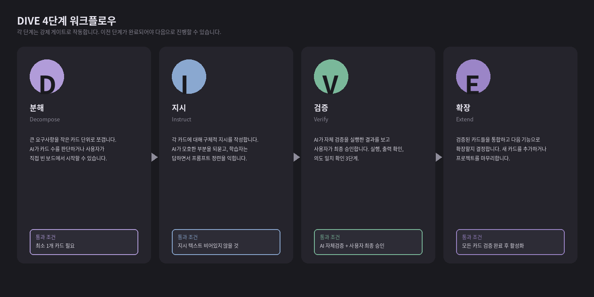

# DIVE

> 바이브 코딩 입문자를 위한 AI 코딩 워크플로우 데스크톱 앱

**DIVE**(Decompose · Instruct · Verify · Extend)는 자연어로 AI에게 코딩을 시키는 방식이 익숙하지 않은 입문자가 안전하고 체계적으로 AI 코딩 에이전트를 활용할 수 있도록 설계된 **Windows 데스크톱 앱**입니다. 한 번에 모든 걸 시키고 결과를 검증하지 않는 대표적 실패 패턴을, **4단계 강제 게이트**로 구조적으로 차단합니다.

[](https://github.com/coreelab/dive/actions/workflows/build.yml)
[](./LICENSE)
[](#설치)

---

## 4단계 워크플로우

| 단계              | 의미                            | 강제되는 행동                               |
| ----------------- | ------------------------------- | ------------------------------------------- |
| **D — Decompose** | 작업을 작은 카드로 분해         | 카드 ≥ 1 없이는 AI에게 말을 걸 수 없음      |
| **I — Instruct**  | 카드마다 구체적 지시 작성       | 지시 없으면 다음 단계 잠금                  |
| **V — Verify**    | AI 자체 검증 + 사용자 최종 승인 | 2단계 게이트로 "눈으로 보지 않은 결과" 방지 |
| **E — Extend**    | 통합 후 다음 카드로 확장        | 모든 카드 V 통과 후에만 활성화              |



---

## 제품화 v4 업데이트

v1.0.0-rc.2 이후 제품화 v4는 데모/개발 surface를 사용자 제품 흐름에서 분리하고, Windows 데스크톱 앱에 필요한 기본 진입점을 보강합니다.

- **Settings > General 단일 설정 허브** — 언어, 테마, 튜토리얼 모드, 연결된 프로바이더 모델 선택을 한 곳에서 조정
- **네이티브 메뉴바** — File/New/Open/Open Recent, View/Settings/Theme, Help/Tutorial 진입점 제공
- **프로젝트 폴더 선택기** — Tauri v2 dialog 기반 폴더 선택을 기본으로 하고 수동 입력 fallback 유지
- **튜토리얼 모드** — 기본 제품 UI는 간결하게 유지하고, 입문자 설명은 명시적으로 켰을 때만 표시
- **개발 전용 demo route** — `?demo=` 페이지는 개발 모드에서만 로드되며 production bundle에서는 제외

### v4 스크린샷 갱신 체크리스트

릴리스 노트/배포 페이지에 스크린샷을 갱신할 때는 다음 화면을 기준으로 캡처합니다. 기존 와이어프레임 이미지는 계속 `images/`에 보존합니다.

- Settings > General: 언어, 테마, 튜토리얼 모드, provider model selector
- Native menu: File > New/Open/Open Recent, View > Settings/Theme, Help > Tutorial
- Project creation/onboarding: 폴더 선택 dialog 진입점

## 설치 (Windows)

**Windows 10 22H2 이상** 또는 **Windows 11** 필요.

### 1. 다운로드

⚠️ **v1.0.0-rc.1은 회수(Yanked)되었습니다.** 해당 빌드는 production AppState가 demo mock으로 와이어드되어 실제 데이터 저장/실 LLM 호출이 동작하지 않습니다. **v1.0.0-rc.2 이상**만 사용하세요.

[GitHub Releases](https://github.com/coreelab/dive/releases/latest) 페이지에서 본인 PC 아키텍처에 맞는 인스톨러를 받으세요:

- **x64 (일반 인텔·AMD)**: `DIVE_<version>_x64-setup.exe`
- **ARM64 (Surface Pro X / Copilot+ PC)**: `DIVE_<version>_arm64-setup.exe`

### 2. 실행

1. 다운로드한 `.exe`를 더블클릭
2. **SmartScreen 경고 — "추가 정보" → "실행"**
   - v1.0 시점에는 EV 코드 서명 미적용이라 정상 동작입니다
   - 코드 서명은 Azure Trusted Signing 도입 검토 중 (`docs/packaging-windows.md` §4)
3. NSIS 설치 마법사 → 기본값 그대로 → 완료

설치 경로: `%LOCALAPPDATA%\Programs\DIVE\` (사용자 프로필, 관리자 권한 불필요)

### 3. 첫 실행

- OS 언어가 한국어면 한국어 UI, 아니면 영어로 시작 (Settings > General에서 전환 가능)
- 온보딩 다이얼로그 → 프로젝트 폴더 선택 → AI 프로바이더 연결(ChatGPT·Claude·OpenAI·OpenRouter 중 하나)

**처음 쓰나요?** → **[30분 튜토리얼 (시나리오 A)](./docs/user-guide/tutorial.md)** 로 4단계 완주.
**문제가 생겼나요?** → [FAQ](./docs/user-guide/faq.md) · [트러블슈팅](./docs/user-guide/troubleshooting.md).

자세한 사용법: [`docs/student-quickstart.md`](./docs/student-quickstart.md) · [`docs/teacher-manual.md`](./docs/teacher-manual.md) · [사용자 가이드 허브](./docs/user-guide/)

---

## 핵심 기능

- **DIVE 4단계 게이트** — 단계 미통과 시 다음 UI 비활성화 (명세 §4)
- **6 프로바이더 지원** — Anthropic · OpenAI · OpenRouter · **ChatGPT Plus/Pro OAuth** · Custom OpenAI-compat · **MCP 서버**
- **권한 카드** — 모든 도구 호출 전 위험도(낮음/보통/높음) + 사용자 승인 (명세 §5.5 · §6.4)
- **자동 체크포인트** — 단계 전환 시 git 기반 스냅샷 · 1-클릭 복원 (§6.5)
- **프롬프트 도우미** — D/I/V/E 단계별 템플릿 + 한국어 모호함 감지 + AI 자체 비평 (§6.6)
- **다국어** — 한국어 · 영어 (§2.5 · §12.3)
- **접근성** — WCAG AA 대비 · 키보드 전용 동작 · 스크린리더 aria-live (§12.2)
- **안전장치** — 차단 명령 블록리스트 · 프로젝트 폴더 외부 쓰기 금지 (§9)

---

## 스크린샷

| 워크맵 + 채팅                      | 권한 카드                                   | 슬라이드 인 패널                            |
| ---------------------------------- | ------------------------------------------- | ------------------------------------------- |
|  |  |  |

더 많은 와이어프레임은 `images/` 디렉터리를 참조하세요.

---

## 개발자 섹션

상세 빌드 가이드는 [`dive/README.md`](./dive/README.md) · [`docs/packaging-windows.md`](./docs/packaging-windows.md)를 참조.

```bash
# 요구사항: Node 22+, pnpm 10+, Rust 1.80+
cd dive
pnpm install
pnpm tauri:dev        # 개발 모드 (hot reload)
pnpm tauri:build:x64  # Windows x64 NSIS
```

### 검증 체크

```bash
cd dive/src-tauri && cargo test --all-targets           # Rust (238+ tests)
cd dive/src-tauri && cargo clippy --all-targets -- -D warnings
cd dive && pnpm typecheck && pnpm lint && pnpm build
cd dive && pnpm dev                                      # 한 터미널
node dive/scripts/verify-i18n.mjs                        # 다른 터미널 (여러 스위트)
```

---

## 설계 원칙 (요약)

- **사고 절차의 외화** — 머릿속 계산을 화면에 보이는 4단계로 분해
- **게이트는 강제, 도구는 자유** — 프로바이더·모델·도구 선택은 사용자 재량
- **가역성** — 자동 체크포인트로 언제든 되돌리기
- **투명성** — 도구 호출·에러·토큰 사용량 모두 채팅 흐름에 노출
- **개인정보 보호** — 기본 로컬 우선, 프로젝트 폴더 외부 접근 차단, 텔레메트리 없음 (§9.4)

전체 명세: [`DIVE_SPEC.md`](./DIVE_SPEC.md) (1600+ 라인)
의사결정 기록: [`DIVE_DECISIONS.md`](./DIVE_DECISIONS.md) (75 ADR)

---

## 연구진

| 연구원             | 소속                  | 역할                                  |
| ------------------ | --------------------- | ------------------------------------- |
| 고규현 (총괄)      | 광교고등학교          | 제품 개발 · 광교고 파일럿 · 명세 총괄 |
| 김나영             | 토평고등학교          | 학생 활동지 · 학술 발표 · 보조 검증   |
| 양회욱             | 어정중학교            | 지도안 · 중학교 baseline              |
| 이장원 교수 (자문) | 경인교대 컴퓨터교육과 | 학술 자문 · 연구 설계                 |

---

## 로드맵

| 시기         | 버전          | 범위                                                                  |
| ------------ | ------------- | --------------------------------------------------------------------- |
| 2026-05      | —             | 기술 스파이크 (Phase 1) ✅                                            |
| 2026-06      | v0.1          | 워크맵 + 채팅 + 권한 카드 (Phase 2) ✅                                |
| 2026-07      | v0.2          | 검증 게이트 + 체크포인트 (Phase 3) ✅                                 |
| 2026-08      | v0.2          | 파일럿 직전 폴리싱 (Phase 4) ✅                                       |
| 2026-10      | v0.3          | Codex OAuth + MCP + 프롬프트 도우미 (Phase 5) ✅                      |
| 2026-05      | **v1.0-rc.1** | **Yanked — demo mock wiring으로 회수 (ADR-052)** ⚠️                   |
| 2026-05      | **v1.0-rc.2** | **Production wiring · disk DB · cards persistence · release gate** 🟡 |
| 2026-11 ~ 12 | **v1.0**      | **파일럿 검증 후 정식 배포**                                          |

Phase별 상세는 [`DIVE_PROGRESS.md`](./DIVE_PROGRESS.md) 참조.

---

## 라이선스

[MIT License](./LICENSE) — Copyright © 2026 DIVE 연구진.

연구 목적·교육 활용·상용 fork 모두 허용. 출처 표기만 유지하세요.

---

## 기여·문의

- 이슈·PR: [GitHub Issues](https://github.com/coreelab/dive/issues)
- 보안 취약점 제보: 별도 이슈 대신 연구진에게 직접 연락
- 파일럿 참여 문의: 광교고 고규현 (총괄)

프로젝트 내부 운영(ralph 자동 구현 루프)은 [`RALPH_README.md`](./RALPH_README.md) 참조.
