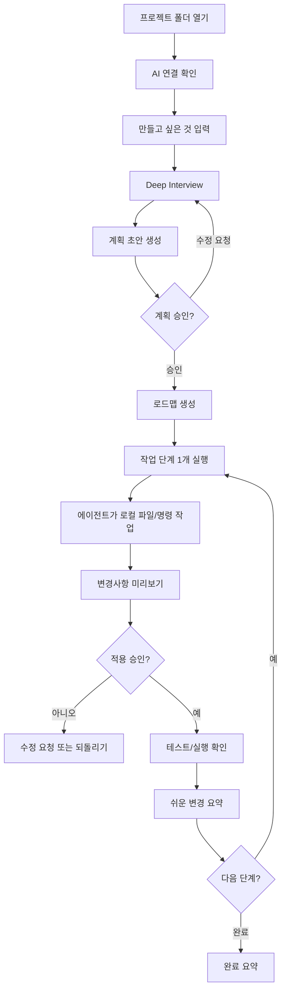

# DIVE-2 Product UX Refactor — Agent Handoff Plan

> 대상 레포: `airmang/DIVE-2`  
> 목표: 기존 D/I/V/E 교육·연구용 워크플로우 앱을, 일반 초심자가 데스크톱 UI로 로컬 코딩 에이전트를 안전하게 조종하는 **Plan-first 제품**으로 리팩토링한다.  
> 핵심 원칙: 백엔드 에이전트 루프를 새로 만들지 말고, 현재 Rust/Tauri 에이전트 기반을 유지하면서 제품 표면, 프론트 상태 구조, 계획/로드맵 UX를 재구성한다.

---

## 0. 근거와 현재 레포 확인 사항

이 계획은 다음 레포 파일과 공식 문서를 근거로 한다. 에이전트는 작업 시작 전 반드시 이 파일들을 직접 열어 현재 main 브랜치 기준으로 재확인해야 한다.

### 레포 근거

1. `README.md`
   - DIVE는 현재 “바이브 코딩 입문자를 위한 AI 코딩 워크플로우 데스크톱 앱”으로 설명된다.
   - 핵심 구조는 Decompose · Instruct · Verify · Extend 4단계 게이트다.
   - README에는 student/teacher/research/final pilot 문맥이 섞여 있어 일반 제품 surface와 충돌한다.

2. `dive/README.md`
   - 기술스택: Tauri 2.x + React + TypeScript + Vite + Rust backend.
   - Rust backend 모듈 구조: `agent`, `dive`, `providers`, `tools`, `mcp`, `auth`, `checkpoint`, `db`, `ipc`.
   - 문서에는 React 18로 적혀 있으나 `package.json`은 React 19.1.0이므로 문서 정합성 수정 필요.

3. `dive/package.json`
   - React 19.1.0, TypeScript 5.8, Vite 7, Zustand 5 사용.
   - 검증 스크립트: `pnpm typecheck`, `pnpm lint`, `pnpm build`, `pnpm verify:v4`.

4. `dive/src-tauri/Cargo.toml`
   - Rust backend는 Tauri 2, rusqlite, reqwest, tokio, keyring, git2 등을 사용.
   - description이 “AI 코딩 교육용 데스크톱 앱”으로 되어 있어 제품 포지셔닝과 맞지 않는다.

5. `dive/src/App.tsx`
   - product route로 `settings`, `prompt-helper`, `research-survey`가 직접 연결되어 있다.
   - 일반 사용자 제품 surface에서는 `research-survey`를 dev/internal로 격리해야 한다.

6. `dive/src/components/shell/MainShell.tsx`
   - 현재 앱의 핵심 orchestration이 한 파일에 집중되어 있다.
   - 프로젝트/세션, 채팅, 워크맵, 메뉴 이벤트, 단축키, 온보딩, 카드 상세, 검증, 체크포인트, 회고 dialog가 한 컴포넌트에서 조율된다.
   - UX가 복잡해지는 1차 원인이다.

7. `dive/src/components/shell/WorkmapStrip.tsx`
   - 현재 로드맵은 하단 strip 구조다.
   - 일반 초심자에게는 항상 보이는 우측 Roadmap panel이 더 적합하다.

8. `dive/src/components/workmap/AiAssistDialog.tsx`
   - 현재 AI 도움은 단발성 “카드 제안”이다.
   - Deep Interview처럼 요구사항을 다중 턴으로 구체화하는 상태ful planning flow가 아니다.

9. `dive/src/components/workmap/CardDetailPanel.tsx`
   - 내부 card state별 UI를 담당한다.
   - 기능은 재사용 가능하지만 “D/I/V/E, 지시, 검증, 회고” 표현을 제품형 언어로 감싸야 한다.

10. `dive/src/stores/workmap.ts`, `dive/src/hooks/useWorkmap.ts`
    - 내부 모델은 card/workmap 중심이다.
    - 바로 DB 모델을 바꾸지 말고, 먼저 `useRoadmap()` adapter로 제품 UI 모델을 감싸는 것이 안전하다.

11. `dive/src-tauri/src/lib.rs`, `dive/src-tauri/src/ipc/mod.rs`
    - production AppState, provider runtime, DB, menu, checkpoint, workmap, provider, MCP, OAuth 등 IPC surface가 이미 존재한다.

12. `dive/src-tauri/src/agent/mod.rs`
    - `AgentLoop`는 user message 저장, provider streaming, tool call 처리, permission hook, tool execution, event emit, DB persistence를 이미 수행한다.
    - 백엔드 에이전트 루프를 갈아엎지 않는다.

13. `dive/src-tauri/src/agent/permission.rs`
    - `PermissionHook`, `PendingApprovals`, `AutoApprovePolicy`, `PolicyAwareHook`이 이미 있다.
    - UI와 mode policy를 바꾸는 쪽이 핵심이다.

14. `dive/src-tauri/src/dive/gate.rs`
    - 현재 gate는 card 중심: 카드가 없으면 D 단계에서 채팅이 막힘.
    - 제품형 flow에서는 “카드를 먼저 만들라”가 아니라 “만들고 싶은 것을 말하면 계획과 작업 단계가 생성된다”가 되어야 한다.

15. `dive/src/pages/settings.tsx`, `dive/src/pages/research-survey.tsx`
    - 연구 전용 설정과 설문이 product surface에 섞여 있다.
    - 일반 사용자용 제품에서는 internal/dev route로 격리해야 한다.

### 외부 도구 공식 문서 근거

1. OpenAI Codex CLI 공식 Help 문서
   - Codex CLI는 로컬에서 코드를 읽고, 수정하고, 명령을 실행할 수 있는 터미널 기반 코딩 에이전트다.
   - Suggest 모드는 읽기와 제안 중심, Auto Edit은 파일 수정 자동화, Full Auto는 sandboxed current directory 안에서 명령 실행까지 수행한다.
   - 이 리팩토링 위임 시 초기 분석은 Suggest/plan-only 방식으로 시작해야 한다.

2. OpenAI Codex 소개 공식 문서
   - Codex는 `AGENTS.md`를 통해 레포별 명령, 테스트 방법, 코드베이스 관례를 전달받을 수 있다.
   - 따라서 이 계획과 별개로 repo-root `AGENTS.md`를 제공하는 것이 유효하다.

3. Anthropic Claude Code 공식 문서
   - Claude Code의 Plan mode는 코드베이스를 분석하고 계획을 작성하지만 source edit은 하지 않는 모드다.
   - permission mode는 default/acceptEdits/plan/auto/dontAsk/bypassPermissions 등으로 구분된다.
   - 이 리팩토링은 처음에 `plan` 모드로 분석하고, PR 단위로 승인 후 구현하는 방식이 안전하다.

4. OpenCode 공식 문서
   - OpenCode는 Build/Plan agent와 permission config를 제공한다.
   - permission은 `allow`, `ask`, `deny`로 제어하며, `edit`, `bash`, `webfetch` 등을 agent별로 override할 수 있다.
   - OpenCode 기본값은 상대적으로 permissive할 수 있으므로 이 리팩토링에서는 PR 단위로 `edit`/`bash`를 제한하는 config를 쓰는 것이 안전하다.

---

## 1. 제품 리팩토링 목표

### 현재 상태

DIVE-2는 기능적으로는 이미 로컬 데스크톱 코딩 에이전트에 가깝다. 그러나 제품 표면은 다음 요소가 섞여 있다.

- 교육용 앱
- 연구용 실험 도구
- 교사용/학생용 문서
- 개발자용 agent tool log
- D/I/V/E 단계 강제 gate
- 카드 기반 workflow
- 데모 route와 product route의 잔존 혼합

### 목표 상태

일반 초심자가 다음 감각으로 사용할 수 있어야 한다.

> “프로젝트 폴더를 열고, 만들고 싶은 것을 말하면, DIVE가 질문을 통해 계획을 세우고, 로드맵을 보여주며, 로컬 에이전트가 실제 파일과 명령 작업을 수행한다. 나는 데스크톱 UI에서 계획, 변경사항, 실행 승인, 테스트 결과, 되돌리기만 확인하면 된다.”

### 핵심 제품 문장

> DIVE is a guided desktop coding agent for beginners: describe what you want to build, confirm a plan, follow a visible roadmap, approve local changes, verify results, and undo safely.

한국어 제품 문구:

> DIVE는 처음 바이브 코딩을 시작하는 사람을 위한 데스크톱 코딩 에이전트입니다. 만들고 싶은 것을 말하면, 계획을 세우고 로드맵을 보여주며, 로컬 프로젝트에서 한 단계씩 안전하게 구현합니다.

---

## 2. 반드시 지켜야 할 리팩토링 원칙

1. **백엔드 에이전트 루프 재작성 금지**
   - `AgentLoop`, provider runtime, permission hook, DB, checkpoint는 유지한다.
   - 필요한 경우 mode/adapter/IPC만 추가한다.

2. **D/I/V/E는 내부 모델로 숨긴다**
   - UI에는 `목표 정리`, `계획 확정`, `작업 중`, `작동 확인`, `완료` 같은 제품형 언어를 쓴다.
   - 내부 state 이름은 당장 변경하지 않아도 된다.

3. **카드 중심에서 계획 중심으로 전환한다**
   - 사용자가 직접 카드를 먼저 만들게 하지 않는다.
   - 사용자는 만들고 싶은 것을 말하고, DIVE가 Deep Interview와 PlanDraft를 통해 작업 단계를 만든다.

4. **로드맵은 항상 보이게 한다**
   - 하단 WorkmapStrip보다 우측 RoadmapPanel을 기본 구조로 둔다.
   - 현재 단계, 다음 행동, 변경 파일 수, 되돌리기 가능 여부를 항상 표시한다.

5. **파일 수정 전 Plan Gate를 통과해야 한다**
   - 계획 승인 전에는 edit/write/bash를 허용하지 않는다.
   - 프롬프트에 의존하지 말고 Rust permission/mode layer에서 차단한다.

6. **초심자는 터미널을 직접 쓰지 않는다**
   - 터미널/명령 실행은 Rust agent backend가 수행한다.
   - UI는 명령 의미, 위험도, 결과 요약, 다음 행동을 제공한다.

7. **연구/교사/학생 기능은 제품 surface에서 제거 또는 internal 격리한다**
   - 연구 설문, ablation setting, teacher/student docs는 public product flow에서 보이지 않아야 한다.

8. **작게 나눈 PR만 허용한다**
   - 한 PR에서 UI 전체와 Rust backend를 동시에 대규모 변경하지 않는다.
   - 각 PR은 검증 명령과 acceptance criteria를 포함해야 한다.

9. **모든 변경에는 검증이 필요하다**
   - frontend 변경: `pnpm typecheck`, `pnpm lint`, 필요 시 `pnpm build`.
   - Rust 변경: `cargo fmt --all -- --check`, `cargo test --features dev-mock --all-targets`, `cargo clippy --features dev-mock --all-targets -- -D warnings`.

---

## 3. 목표 UX Flow



---

## 4. UI 정보 구조

### 기존 기본 구조

```text
Sidebar + ChatArea + bottom WorkmapStrip + SlideInPanel + many dialogs
```

### 목표 기본 구조

```text
TopBar
ProjectRail | ConversationPanel | RoadmapPanel
ActionDock
ModalHost
```

### 화면 와이어프레임

```text
┌────────────────────────────────────────────────────────────────┐
│ DIVE    현재 프로젝트: my-app    AI 연결됨    되돌리기 가능      │
├───────────────┬──────────────────────────────┬─────────────────┤
│ ProjectRail   │ ConversationPanel             │ RoadmapPanel     │
│               │                              │                 │
│ 현재 폴더      │ 무엇을 만들고 싶나요?          │ 1. 목표 정리     │
│ 최근 작업      │                              │ 2. 계획 확정     │
│ 설정           │ DIVE 질문 / 사용자 답변        │ 3. 기능 구현     │
│               │                              │ 4. 작동 확인     │
│               │                              │ 5. 완료          │
├───────────────┴──────────────────────────────┴─────────────────┤
│ 다음 행동: 답변하기 | 계획 보기 | 변경사항 보기 | 되돌리기        │
└────────────────────────────────────────────────────────────────┘
```

---

## 5. 용어 매핑

| 내부/기존 표현 | 제품 UI 표현 |
|---|---|
| D 단계 | 목표 정리 |
| I 단계 | 작업 지시 |
| V 단계 | 작동 확인 |
| E 단계 | 다음 단계 |
| 카드 | 작업 단계 |
| 워크맵 | 로드맵 |
| 세션 | 작업 기록 또는 대화 |
| 프로바이더 | AI 연결 |
| 권한 카드 | 실행 전 확인 |
| 검증 | 작동 확인 |
| 회고 | 변경 요약 |
| 연구 설문 | internal/dev 전용 |
| 교사용 | 제거 또는 docs/internal 이동 |
| 학생용 | “초심자용” 또는 “처음 사용하는 사람” |

---

## 6. 리팩토링 PR 계획

### PR 1 — Product Surface Cleanup

**목표**  
제품 표면에서 연구·교사·학생 문맥을 제거하거나 internal/dev로 격리한다.

**주요 파일**

- `README.md`
- `dive/README.md`
- `dive/src-tauri/Cargo.toml`
- `dive/src/App.tsx`
- `dive/src/pages/settings.tsx`
- `dive/src/pages/research-survey.tsx`
- `dive/src/i18n/ko.json`
- `dive/src/i18n/en.json`

**작업**

1. README 제품 소개를 일반 초심자용으로 수정한다.
2. 연구진/교사용/학생용 문서 링크는 `docs/internal` 또는 “연구 배경” 하위 섹션으로 이동한다.
3. `dive/README.md`의 React 버전 정합성을 `package.json`과 맞춘다.
4. `Cargo.toml` description을 제품형으로 수정한다.
5. `research-survey` product route를 제거하거나 dev/internal flag 뒤로 숨긴다.
6. Settings의 연구 전용 설정은 dev/internal일 때만 노출한다.
7. i18n에서 “학생/교사/차시/연구 전용” 문구를 제품 surface에서 제거한다.

**Acceptance Criteria**

- 일반 사용자가 첫 실행 flow에서 연구 설문, teacher/student manual, ablation setting을 보지 않는다.
- `?route=research-survey`가 production product route로 열리지 않는다.
- README의 제품 소개가 “일반 초심자용 데스크톱 코딩 에이전트”로 정리된다.
- `pnpm typecheck`, `pnpm lint`, `pnpm build` 통과.

---

### PR 2 — Split MainShell into Product Shell Components

**목표**  
`MainShell.tsx`의 책임을 줄이고 제품 UX 컴포넌트 구조를 만든다.

**주요 파일**

- `dive/src/components/shell/MainShell.tsx`
- 신규: `dive/src/components/product/ProductShell.tsx`
- 신규: `dive/src/components/product/TopBar.tsx`
- 신규: `dive/src/components/product/ProjectRail.tsx`
- 신규: `dive/src/components/product/ConversationPanel.tsx`
- 신규: `dive/src/components/product/RoadmapPanel.tsx`
- 신규: `dive/src/components/product/ActionDock.tsx`
- 신규: `dive/src/components/product/ModalHost.tsx`

**작업**

1. `MainShell`은 `<ProductShell />` wrapper로 축소한다.
2. layout 책임을 `ProductShell`로 이동한다.
3. 기존 `Sidebar`, `ChatArea`, `WorkmapStrip`, dialogs는 일단 새 shell 아래로 옮기되 기능 변화는 최소화한다.
4. modal open/close state를 `ModalHost` 또는 `useModalCoordinator`로 이동한다.
5. 메뉴 이벤트와 단축키 연결은 `ProductShell` 또는 hook으로 분리한다.

**Acceptance Criteria**

- 기능 회귀 없이 `MainShell.tsx`가 얇아진다.
- `ProductShell`에서 전체 레이아웃을 통제한다.
- `pnpm typecheck`, `pnpm lint` 통과.

---

### PR 3 — Roadmap Adapter over Workmap/Card Model

**목표**  
기존 card/workmap 내부 모델은 유지하되 UI에서는 roadmap/step 모델로 감싼다.

**주요 파일**

- `dive/src/hooks/useWorkmap.ts`
- `dive/src/stores/workmap.ts`
- 신규: `dive/src/features/roadmap/types.ts`
- 신규: `dive/src/features/roadmap/useRoadmap.ts`
- 신규: `dive/src/features/roadmap/cardToStep.ts`

**작업**

1. `CardTileData` → `RoadmapStep` adapter를 만든다.
2. 내부 state `decomposed/instructed/verifying/verified/rejected/extended`를 제품 상태 `planned/ready/checking/done/needs_changes/extended`로 매핑한다.
3. UI 컴포넌트는 직접 `CardTileData`를 받지 말고 `RoadmapStep`을 받도록 점진 전환한다.

**Acceptance Criteria**

- DB schema 변경 없음.
- 기존 workmap IPC 변경 없음.
- 제품 UI에서 “카드”, “D/I/V/E” 노출이 줄어든다.
- `pnpm typecheck`, `pnpm lint` 통과.

---

### PR 4 — Replace Bottom WorkmapStrip with Persistent RoadmapPanel

**목표**  
하단 WorkmapStrip 중심에서 우측 RoadmapPanel 중심으로 바꾼다.

**주요 파일**

- `dive/src/components/shell/WorkmapStrip.tsx`
- `dive/src/components/product/RoadmapPanel.tsx`
- `dive/src/components/product/ProductShell.tsx`
- `dive/src/components/workmap/WorkmapCardList.tsx` 또는 신규 `RoadmapStepList.tsx`

**작업**

1. 우측 RoadmapPanel을 기본 배치한다.
2. 진행률, 현재 단계, 단계 상태, 다음 행동을 표시한다.
3. WorkmapStrip은 제거하거나 legacy/internal component로 격리한다.
4. “카드 추가” 버튼을 “계획 수정” 또는 “작업 단계 추가”로 변경한다.

**Acceptance Criteria**

- 로드맵이 기본 화면에서 항상 보인다.
- 하단 strip이 기본 UX를 차지하지 않는다.
- 현재 단계와 다음 행동이 명확하다.
- `pnpm typecheck`, `pnpm lint`, `pnpm build` 통과.

---

### PR 5 — Deep Interview + PlanDraft Flow

**목표**  
단발성 AI 카드 제안을 다중 턴 Deep Interview와 Plan Review로 바꾼다.

**주요 파일**

- `dive/src/components/workmap/AiAssistDialog.tsx`
- 신규: `dive/src/features/planning/types.ts`
- 신규: `dive/src/features/planning/PlanInterviewPanel.tsx`
- 신규: `dive/src/features/planning/PlanReviewPanel.tsx`
- 신규: `dive/src/features/planning/usePlanInterview.ts`
- Rust IPC 추가 가능: `plan_interview_next`, `plan_generate`, `plan_accept`

**작업**

1. `ProjectBrief` 타입을 정의한다.
2. 한 턴 최대 3개 질문, 선택지 제공, “잘 모르겠음” 허용 정책을 구현한다.
3. 2~3턴 후 반드시 PlanDraft를 제시한다.
4. PlanDraft에는 goal, MVP, non-goals, steps, success criteria, risks가 포함되어야 한다.
5. 사용자가 PlanDraft를 승인하면 기존 `card_create` path를 통해 내부 작업 단계를 생성한다.

**Acceptance Criteria**

- 사용자는 카드부터 만들지 않고 “만들고 싶은 것”을 말하며 시작한다.
- 계획 승인 전에는 Build 작업으로 넘어가지 않는다.
- PlanDraft 승인 후 RoadmapPanel에 단계가 생성된다.
- `pnpm typecheck`, `pnpm lint`, Rust 변경 시 cargo checks 통과.

---

### PR 6 — Plan-first Permission Profile / AgentRunMode

**목표**  
계획 승인 전 파일 수정과 명령 실행을 Rust 레벨에서 막는다.

**주요 파일**

- `dive/src-tauri/src/agent/mod.rs`
- `dive/src-tauri/src/agent/permission.rs`
- `dive/src-tauri/src/ipc/mod.rs`
- 신규 가능: `dive/src-tauri/src/agent/run_mode.rs`

**작업**

1. `AgentRunMode`를 도입한다.

```rust
pub enum AgentRunMode {
    Interview,
    Plan,
    Build,
    Verify,
    Recovery,
}
```

2. mode별 tool permission profile을 만든다.

| Mode | Policy |
|---|---|
| Interview | no edits, no bash |
| Plan | read/list/search only |
| Build | edit/write/run only after step approval |
| Verify | test/run/read/diff focused |
| Recovery | checkpoint restore/read/diff |

3. `chat_send` 또는 신규 IPC에서 run mode를 받도록 한다.
4. 계획 승인 전에는 `write_file`, `edit_file`, `delete_file`, `mkdir`, `run_process`, `bash`를 deny한다.

**Acceptance Criteria**

- 프롬프트 우회로도 계획 전 edit/write/bash가 실행되지 않는다.
- Plan mode에서 read/search/list만 가능하다.
- 기존 permission approval UI는 계속 동작한다.
- Rust tests/clippy 통과.

---

### PR 7 — Beginner Execution UI

**목표**  
tool log 중심 UI를 초심자용 실행 전 확인, 명령 설명, 변경 요약 중심 UI로 바꾼다.

**주요 파일**

- `dive/src/components/chat/MessageList.tsx`
- `dive/src/components/permission-card/*`
- 신규: `dive/src/features/execution/ToolApprovalCard.tsx`
- 신규: `dive/src/features/execution/CommandExplainer.tsx`
- 신규: `dive/src/features/execution/StepExecutionPanel.tsx`

**작업**

1. tool call을 raw JSON/log로 기본 노출하지 않는다.
2. 파일 수정 tool은 “어떤 파일을 왜 바꾸는지”를 먼저 보여준다.
3. run command는 “무슨 명령인지, 파일을 바꾸는지, 실패하면 어떻게 되는지”를 설명한다.
4. 상세 raw log는 접힌 advanced view로 둔다.

**Acceptance Criteria**

- 초심자용 설명이 기본이다.
- raw logs는 기본 접힘이다.
- 승인/거부 흐름은 기존 IPC와 호환된다.
- `pnpm typecheck`, `pnpm lint`, `pnpm build` 통과.

---

### PR 8 — Patch Preview + Recovery/Undo Center

**목표**  
수정 전 diff preview와 되돌리기를 제품 중심 기능으로 만든다.

**주요 파일**

- `dive/src/components/slide-in/SlideInPanel.tsx`
- 신규: `dive/src/features/execution/PatchPreviewPanel.tsx`
- 신규: `dive/src/features/recovery/RecoveryPanel.tsx`
- 신규: `dive/src/features/recovery/UndoBar.tsx`
- Rust checkpoint IPC는 기존 것을 활용

**작업**

1. diff preview를 “변경 요약 + 파일 목록 + 위험도 + 자세한 diff” 구조로 표시한다.
2. 적용 전 메시지: “아직 파일은 바꾸지 않았습니다” 또는 “적용 전 변경사항입니다”를 명확히 표시한다.
3. 체크포인트를 “되돌리기 기록”으로 노출한다.
4. 실패 시 RecoveryPanel에서 `다시 시도`, `계획 수정`, `되돌리기` 선택지를 제공한다.

**Acceptance Criteria**

- 변경 전/후를 초심자가 이해할 수 있다.
- 되돌리기 가능 여부가 TopBar 또는 ActionDock에 항상 보인다.
- 실패 시 다음 행동이 반드시 표시된다.
- frontend checks 통과.

---

### PR 9 — Settings Simplification

**목표**  
Settings를 일반 사용자용으로 재구성한다.

**현재 문제**

`settings.tsx`에는 일반, provider, 자동 승인 정책, 연구 전용 설정, MCP 서버가 한 화면에 섞여 있다.

**목표 구조**

```text
설정
├── AI 연결
├── 앱 설정
├── 안전 설정
└── 고급
```

**작업**

1. `프로바이더`를 `AI 연결`로 변경한다.
2. `자동 승인 정책`, `MCP 서버`는 `고급` 섹션 아래로 이동한다.
3. 연구 전용 설정은 dev/internal flag 뒤에 둔다.
4. 튜토리얼 모드는 “자세한 설명 보기”로 변경한다.

**Acceptance Criteria**

- 초심자가 처음 설정 화면에서 API 연결, 언어, 테마, 안전 설정만 쉽게 본다.
- advanced 기능은 접힌 상태 또는 별도 탭이다.
- 연구 설정은 production product surface에 없다.
- checks 통과.

---

### PR 10 — Copy Polish + Onboarding Productization

**목표**  
첫 실행 UX와 모든 주요 문구를 일반 초심자 제품에 맞춘다.

**작업**

1. 첫 실행 화면:
   - 프로젝트 폴더 선택
   - AI 연결
   - 만들고 싶은 것 입력
   - 계획 생성
2. 모든 주요 문구에서 교육/연구/교사/학생 냄새 제거.
3. “DIVE 4단계” 설명은 자세한 설명 보기 또는 docs로 이동.
4. onboarding empty state를 명확히 한다.

**Acceptance Criteria**

- 일반 사용자가 앱을 켜고 1분 안에 무엇을 해야 하는지 안다.
- 첫 메시지는 “무엇을 만들고 싶나요?” 중심이다.
- 제품 문구가 일관된다.
- checks 통과.

---

## 7. 검증 명령

### Frontend

```bash
cd dive
pnpm install
pnpm typecheck
pnpm lint
pnpm build
```

### Rust

```bash
cd dive/src-tauri
cargo fmt --all -- --check
cargo test --features dev-mock --all-targets
cargo clippy --features dev-mock --all-targets -- -D warnings
```

### 전체 권장 검증

```bash
cd dive
pnpm typecheck && pnpm lint && pnpm build
cd src-tauri
cargo fmt --all -- --check && cargo test --features dev-mock --all-targets && cargo clippy --features dev-mock --all-targets -- -D warnings
```

---

## 8. 금지 사항

1. 한 PR에서 전체 리팩토링을 끝내려 하지 말 것.
2. DB schema를 불필요하게 먼저 변경하지 말 것.
3. `AgentLoop`를 새로 작성하지 말 것.
4. production route에 research survey를 계속 노출하지 말 것.
5. 계획 승인 전 파일 수정/명령 실행을 허용하지 말 것.
6. raw tool log를 초심자 기본 화면에 계속 노출하지 말 것.
7. D/I/V/E 용어를 제품 핵심 UI에 계속 노출하지 말 것.
8. verification 실패를 단순 error toast로만 처리하지 말 것.
9. `bypass`, `full auto`, `dangerously skip permissions` 같은 모드로 실행하지 말 것.
10. 테스트 없이 “UI만 바뀜”이라고 마무리하지 말 것.

---

## 9. 최종 완료 정의

이 리팩토링은 다음이 만족될 때 완료다.

1. 사용자는 카드를 먼저 만들지 않고, 만들고 싶은 것을 말하며 시작한다.
2. DIVE가 Deep Interview로 요구사항을 구체화한다.
3. 계획 초안이 생성되고, 사용자가 승인해야 구현이 시작된다.
4. 우측 RoadmapPanel에서 전체 단계와 현재 위치가 항상 보인다.
5. 각 작업 단계는 하나씩 실행된다.
6. AI의 파일 변경은 쉬운 설명과 diff preview로 표시된다.
7. 명령 실행은 의미와 위험도가 설명된 후 승인된다.
8. 실패 시 RecoveryPanel이 다음 행동을 제공한다.
9. 되돌리기 기능이 항상 보인다.
10. 연구/교사용 기능은 제품 surface에서 보이지 않는다.
11. frontend/Rust 검증 명령이 통과한다.

